<!-- TOC -->

- [1.Overview：<div id="E"></div>](#1overview%EF%BC%9Adiv-id%22e%22div)
- [2.Getting SDK：<div id="Mark"></div>](#2getting-sdk%EF%BC%9Adiv-id%22mark%22div)
- [3.About code：<div id="ark"></div>](#3about-code%EF%BC%9Adiv-id%22ark%22div)
  - [（1）Android：<div id="a"></div>](#%EF%BC%881%EF%BC%89android%EF%BC%9Adiv-id%22a%22div)
  - [（2） IOS：<div id="b"></div>](#%EF%BC%882%EF%BC%89-ios%EF%BC%9Adiv-id%22b%22div)
    - [Access <div id="c"></div>](#access-div-id%22c%22div)
    - [Notes <div id="d"></div>](#notes-div-id%22d%22div)
- [4.Statistical issues<div id="rk"></div>](#4statistical-issuesdiv-id%22rk%22div)

<!-- /TOC -->
## 1.Overview：<div id="E"></div>
1. How to create  for a Yumimobi  account?
* Sign into the [Yumimobi](https://www.Yumimobi.com/)，click "Register Now" or "Developers" .
* Fill in the registration information.
   
  Note: The login password will be sent to the email address that was filled in at the time of registration. The email  will be used as the login account and cannot be changed.
  
  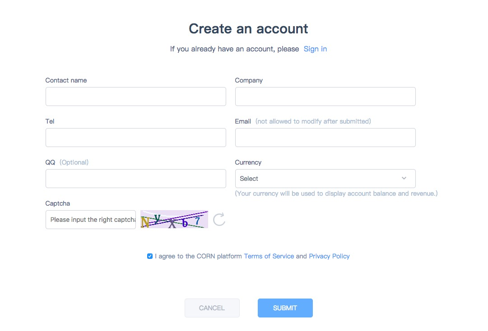
2. If the app is not online, how should I fill out the app store link?
   
  * The download address is used for review. After the application is online, it can be updated to the latest application address, not required.
3. If the app store advertisement address/package name of app doesn’t match the applied app, will it show ads?
* Does not affect the display of the ad, but will affect the performance of the ad or the effect of the data, please be sure to ensure the consistency of the app store address.
  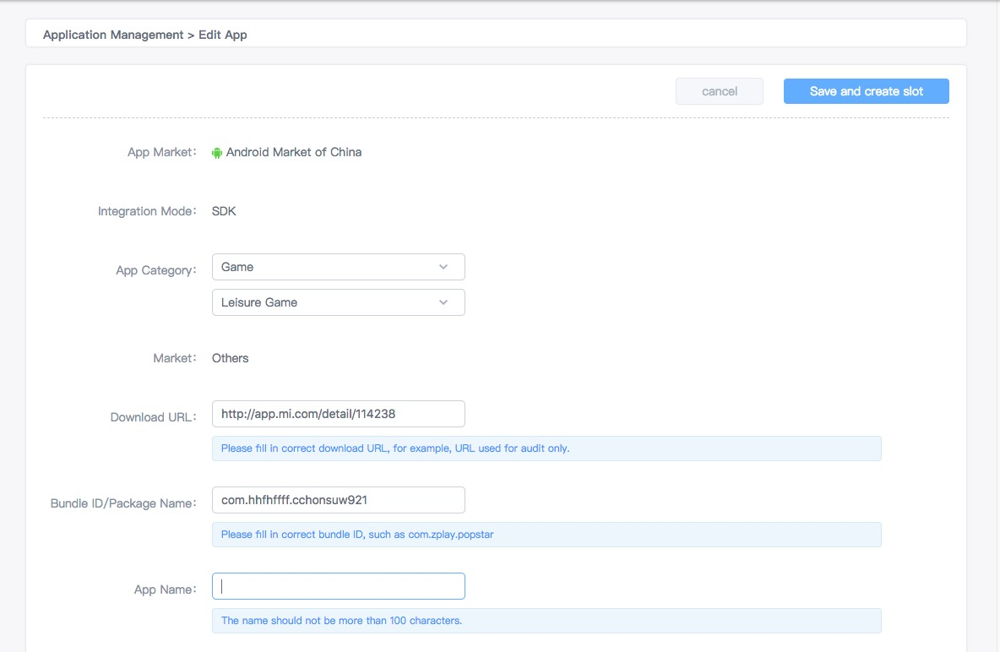
4. If using the Yumi mediation SDK, how is the three-party platform ID configured?
* The developer accesses the Network SDK and registers the parameters on the three-party platform and fills in the YUMI SSP to realize the aggregation and realization function.
  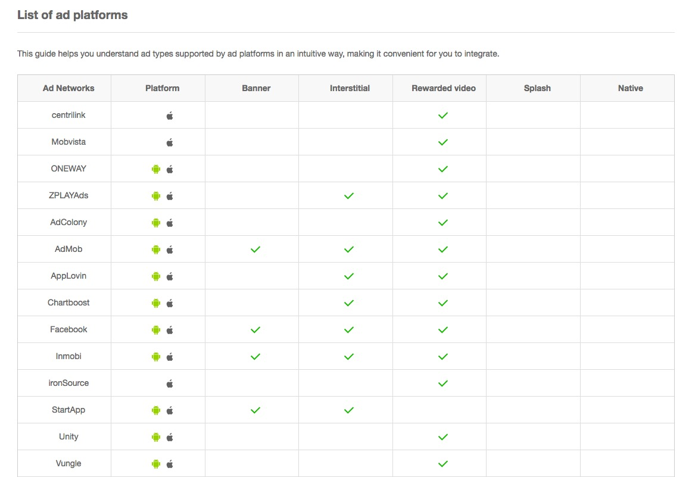
5. After the app is applied, if it is in the review cycle, can it be tested while it is under pending approval?
* The application review period is 3 business days; the advertising test will not be affected during the review period, but no advertising revenue will be generated.
  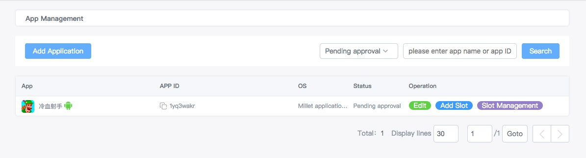
6. What advertisement formats does the Yumi mediation SDK support?
* The Yumi mediation SDK supports all main-stream forms of advertisement, including banners, interstitials, motivational videos, splashes, natives. The specific integrate method can be viewed in the [document center](http://doc.ssp.Yumimobi.com/IntegrateGuide/index).

  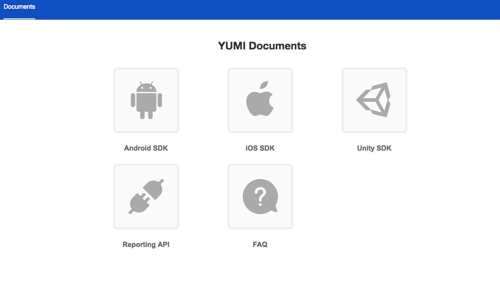
7. If the app updates, do I need to update the Yumi mediation SDK to the latest version?
* In order to ensure the advertisement revenue, please use the latest version of the Yumi mediation SDK when the app updates. You can check the [update logs](http://doc.ssp.Yumimobi.com/UpdateLog/index) to see the specific updating content of each version.
  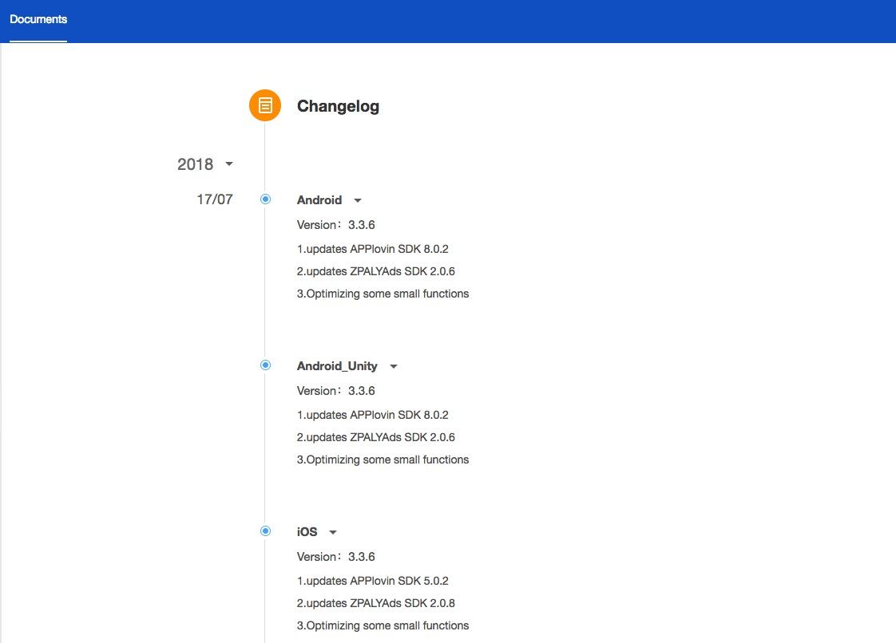
8.  How do I temporarily turn off advertisement service?
* Ad suspension or delivery status can be achieved by setting the status of the ad; pausing the ad directly affects app revenue, please be cautious
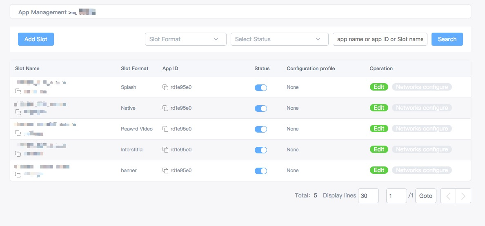

## 2.Getting SDK：<div id="Mark"></div>
1. How to get SDK?
* You can get SDK through the Yumimobi SDK. Sign into your account, enters the [document center](http://doc.ssp.Yumimobi.com/IntegrateGuide/index) to download the Yumi mediation SDK, and then integrates it to your project according to the document.
2. How do I view the SDK updating record of each version?
* The Yumi background provides the latest version of SDK, enter the document center-[update logs](http://doc.ssp.Yumimobi.com/UpdateLog/index) to view the updated SDK version and its updating logs.


## 3.About code：<div id="ark"></div>
### （1）Android：<div id="a"></div> 
1. When the advertisement materials have problems with morphing, jumping, how to solve these?
* You should Provide material screenshots, keywords, material addresses, and material jump links.

  
  
2. Why is the method described in the document not found?
* The integrated SDK and the reference document are not the same version.

3. Why does system crash after only updating the core jar package?
* When updating the version, the core jar package and adapter need to be updated at the same time. The new version of three-party platform may have been updated or the core jar package changes when call adapter, it may cause a crash or failed request of advertisements if you use the old adapter.
  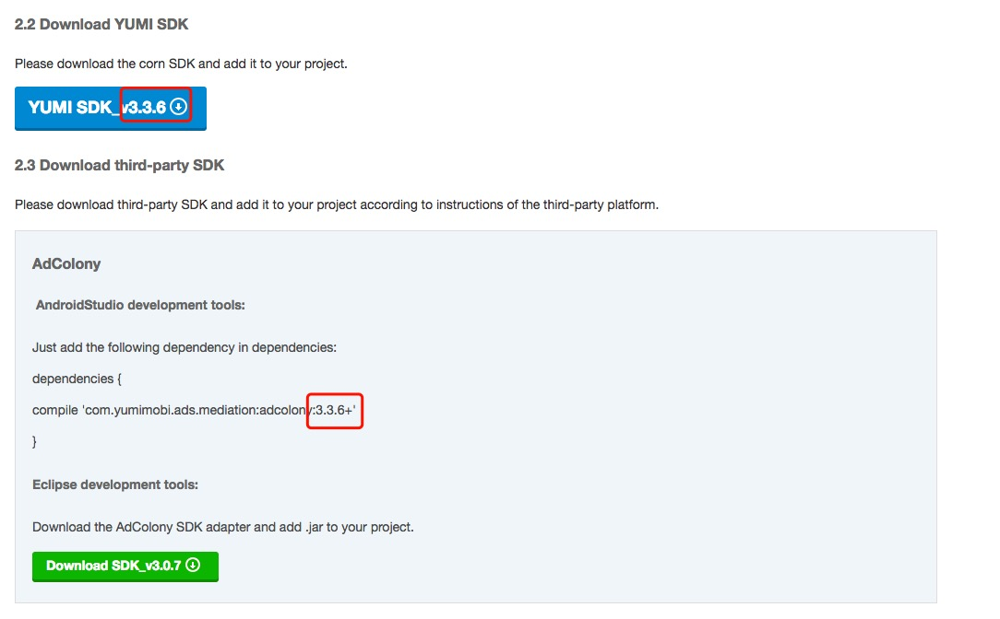
4. It does not need to distinguish between channels and versions of app, how do I fill in these two parameters?
* There is no need to distinguish between channels and versions in the process of app integration. 
* The channel version in the integrating process can be leaf empty directly. If you need to distinguish the effects of different channel versions, you can directly fill in the corresponding parameter values. 
   example: Will hero of 510 version need to be released to the Huawei channel, fill in banner.setChannelID(123);banner.setVersionName(510);
  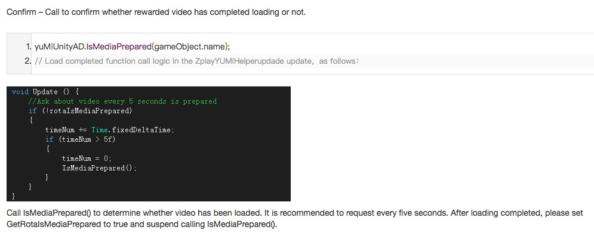
5. Adding  video ads leads to game stuck?
* Please check if the isMediaPrepared() method is called too frequently. It is generally recommended to call it every 5 seconds. If the call is not limited, the memory usage may increase.
  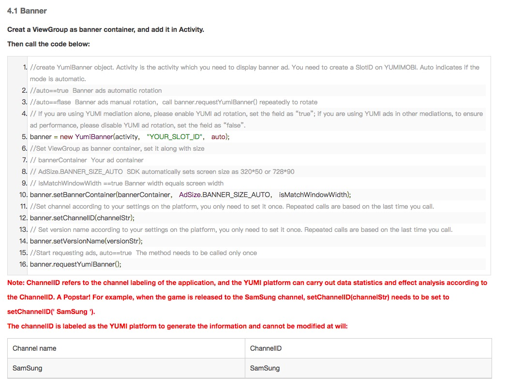
6. Why does the game black out after calling the ads show method? 
* The game or app will get stuck if you call the show method when the video or interstitial is not ready and do the next logical processing only in the impression callback.
  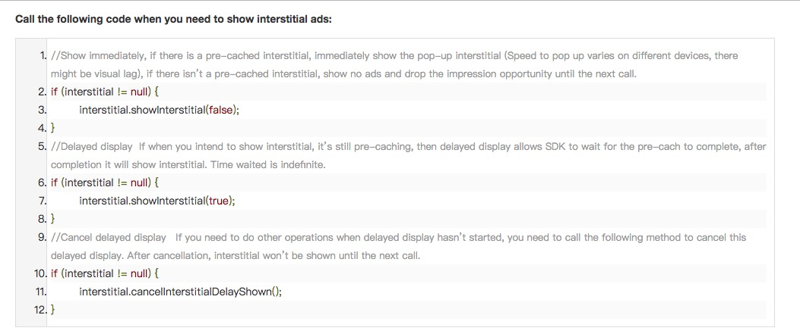
7.Why dose the ads not displayed after calling show method?
* The request method is called again in the show method.
* The show method is called when the interstitial or video is not ready. Please refer to the document [Android SDK integrate document](http://doc.ssp.Yumimobi.com/AndroidSdk/index).
  
8. Why does the interstitial display itself suddenly?
* The parameters in the showInterstitial(false) method represent whether it automatically display. If the fill is true, it will automatically display after the interstitial advertisement is ready. Please refer to the documentation of [Performance of the interstitial advertisements](http://doc.ssp.Yumimobi.com/AndroidSdk/index).
  
 9. The protobuf package conflict? 
* If you use protobuf in your project and conflict with the protobuf included in the Yumi mediation SDK, please try to use the protobuf in the Yumi mediation SDK.
*  If the Yumi mediation SDK does not meet your needs, you can delete the protobuf in the Yumi jar package(open and delete with rar). But be sure to notify the Yumi  ( email to support@Yumimobi.com) that you have removed the protobuf from the Yumi core package so that we can close the relevant modules that need to use protobuf through the background.

10.  What should I do if the number of methods exceeds the standard when packaging? (The number of methods exceeds 65535)
* You can ask our business staff to add priority to the three-party platform and delete the three-party platform adapter according to priority.

* You can avoid this situation by compiling the multi-dex package recommended by google with multi-dex compilation method.

a. Import multi-dex package, set to support multi-dex output mode

```
defaultConfig {   
        applicationId "XXX"
        minSdkVersion 14
        targetSdkVersion 23
        multiDexEnabled true
}

dependencies {
        compile 'com.android.support:multidex:1.0.1'
 }
```
b.  Application class reride method：

```
@Override
       protected void attachBaseContext(Context base) {
       super.attachBaseContext(base);
       MultiDex.install(this);
}
```
11. Why are there no advertisements in Android 6.0 and above system? 

* Permission system has changed in the Android 6.0 system. The permission for user privacy must be dynamically obtained, that is, the bullet permission prompt box. The Yumi mediation SDK provides a method for dynamically obtaining permissions: YumiSettings.runInCheckPermission(true); because some developers conduct by themselves, so the method is false by default. Please refer to the document for [Android 6.0 above system permissions processing](http://doc.ssp.Yumimobi.com/AndroidSdk/index).
  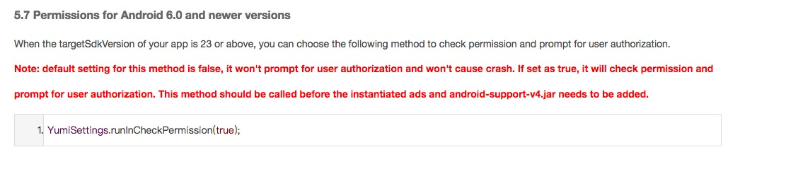
12. Android studio integration uses remote dependencies and remote dependency package download failed, compiler prompt: Could not find any matches for com.Yumimobi.advertisements:mediation:3...+ as no versions of com.Yumimobi.advertisements:mediation are available. How to solve it?
*  1、 Confirm that jcenter support is configured in the main build.gradle of the Project root directory of android studio.
```
buildscript {
    repositories {
        jcenter()
    }
}
allprojets {
    repositories {
        jcenter()
    }
}

```
* 2、 add build.gradle in the project:
　
```
repositories {
    jcenter {
        url "http://jcenter.bintray.com/"
    }
}

```

13.  What is the use of the three-party platform? How to integrate?
* Adding a three-party platform can increase the advertisement fill rate: adding the jar package (Yumi_advertisementapter__v3...jar) to your project, and adding the corresponding dependencies to the [SDK integration document](http://doc.ssp.Yumimobi.com/AndroidSdk/index). If you use Android studio, just add the dependency in builde.gradle: compile 'com.Yumimobi.advertisements.mediation:***:3...+' . Take unity as an example:

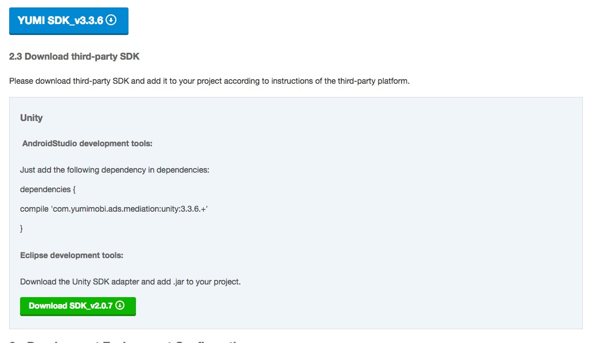

14. How to judge whether the integration is abnormal or without advertisement fills?
* You can open the debug mode window to see if the three-party platform is properly integrated.
* You can also check whether there is a request according to the packet capture tool, and whether the request is returned to judge whether it is abnormal. If there is no request, please do corresponding processing according to the description of the debugging mode in the document.
* If there is a request but there is no displayed advertisement, please check if the returned result is a common network error such as 404 or 500. The Response Code is usually returned to 200 under normal conditions. Network request errors are generally non-client errors.
  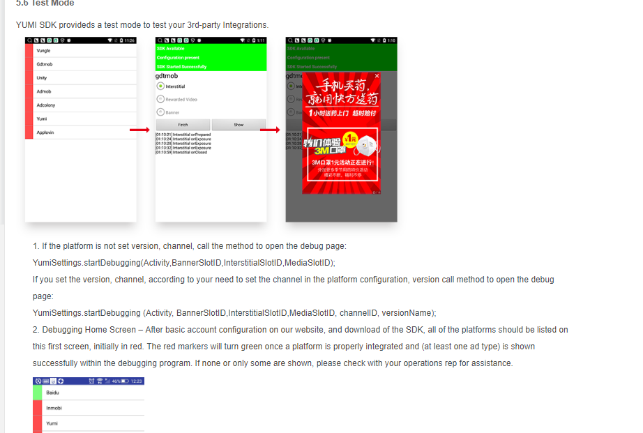   
15. When debugging the interstitial and motivational video, click the FETCH button and appear interstitial onPrepareFailed LayerErrorCode: ERROR_NO_FAIL MSG_CODE 5.What is the error? 
* The advertisement is not filled. Confirming the network status and trying multiple times; you can also contact the Yumi operator and provide the corresponding advertisement slot ID (you can send an email to support@Yumimobi.com) to configure more advertisement sources.

    

16.  There is no problem with SDK integrate. Why can not request an advertisement after changing the official ID? 
* It is possible that the new advertisement slot ID has not been configured yet. Contact the Yumi related staff and provide the corresponding advertisement slot ID (you can send an email to support@Yumimobi.com) to confirm the configuration.

### （2） IOS：<div id="b"></div>    
#### Access <div id="c"></div>
1. Why is there no callback for unity/vungle?
* Both the screen and video parameters need to be configured at the same time and confirm the relevant configuration.
2. Demo cannot complied, how to solve it?
* Check whether the demo version and the SDK integration version are consistent. According to Githubdizhi provided by the official website, check the corresponding version under the branch of Branch [demo advertisementdress](https://github.com/Yumimobi/YumiMediationSDKDemo-iOS/tree/branch_3.2.0).
3. Demo getting address is the main version number, how to get the demo of sub version number in corresponding SDK?
* Later versions of 320 can update the demo by modifying the ‘podfile’ in the demo, or you can find the [demo address](https://github.com/Yumimobi/YumiMediationSDKDemo-iOS/tree/branch_3.2.0) by yourself.

4. Why is the page prompt 'warning NOT advertisement config' and platform displayed in gray in debug mode?
* Confirm that SDK has completed initialization in debug mode and has made an advertisement request in normal mode.
* There is no advertisement configuration, please contact the Yumi related staff and provide the corresponding advertisement slot ID (you can send an email to support@Yumimobi.com) to confirm the configuration.

  
 5. Why are some platforms not shown in debug mode?
 * The platform is not integrated to app, please ensure that the platform has integrated. For example, you need to test zplay advertisements separately but you don't find any information on the platform, then you need to confirm whether you have integrated the platform.

  

6. Cannot display advertisements / cannot see any advertisement reporting addresses?
* Confirm the setting status of ATS (App Transport Security) proposed by WWDC 15 which is an important way for Apple to promote network communication security. In iOS 9 and above, non-HTTPS network integrate is prohibited by default. Since most of advertisement materials are available in form of HTTP , please make the following settings to increase the advertisement fill rate:
  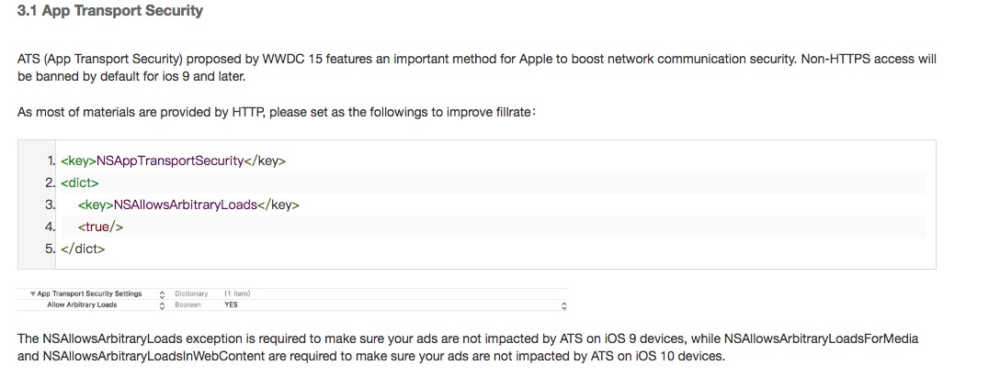

####   Notes <div id="d"></div>

1. Be cautious about the validation of podspec file: s.vendored_libraries = libxxx.a (prefix must be lib).
     
2. After the video SDK calls debug center, it will cause the singleton object delegate to be released. 

3. Admob requires GLKit.framework in some cases.
4. If you use CocoaPods for the first time, please check out [CocoaPods Guides](https://guides.cocoapods.org/using/using-cocoapods.html).
5. 322 video is optimized.The main package needs to be updated when integrated, and pod integration needs to execute pod repo update and then execute pod update.

## 4.Statistical issues<div id="rk"></div>
 1. When does Yumi advertising statistics and revenue update?

* The statistics are displayed in real time (with a 2 to 3 hour delay) and the advertising revenue is displayed at 16:30 next day.   

2. Statistics or revenue is not updated on time. How to solve it?
* It may due to statistical delay, please be patient; if you have not seen the statistics for a long time, please send your feedback to us timely ( you can send an email to support@Yumimobi.com ).

3. Why does eCPM fluctuate?
* The fluctuation of eCPM is determined by ctr and cpc. In most cases, ctr is basically stable; the fluctuation of cpc is mainly caused by the change of advertising competition. Advertiser's budget will affect the cpc of the market in different periods. If the traffic growth of market is too fast during a certain period, it may affect eCPM because advertiser's bid is insufficient.


