### Instructions for developer system

### One、dashboard
 After deveoper log in , data of the past 7 days will be showed on the homepage by default, developer can directly check the trend graph of impressions and income in the past 7 days . 

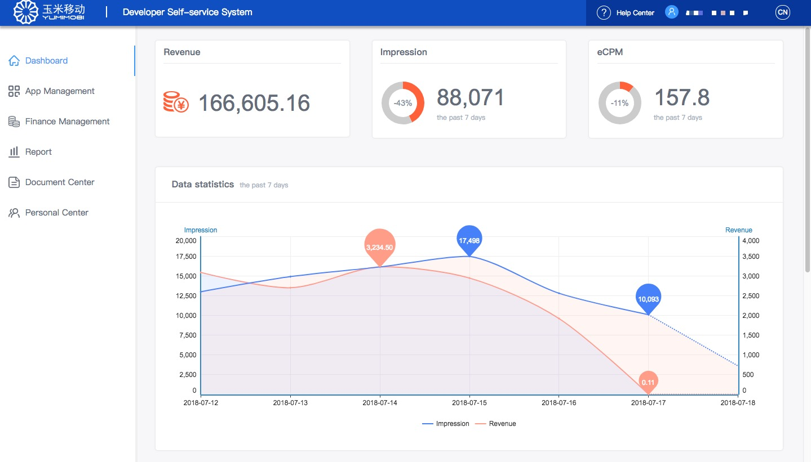
###Two、Developer's application management 
##### 1.Developer's application management
All app imformation taht developer created will show on this page. After the app is created, it needs to wait for the audit. Only after it is approved can the flow be realized. 
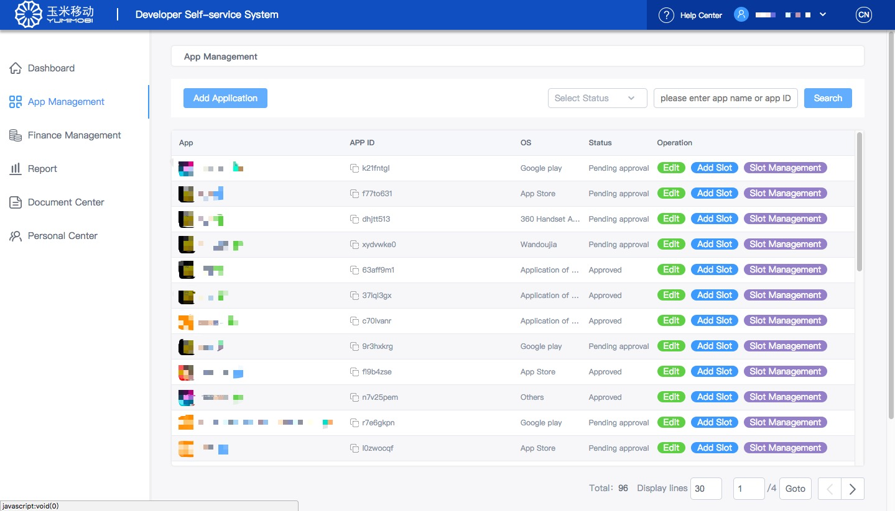

##### 2.Add application 
Step 1:Click on the list of applications,click on the 'add appication'and enter the interface of app creation ,fill in the fundemental imformation of app and save it,then enter the page of creating ad slot; the integration mode of app is the same to the one of account and both of them wil not be edited.
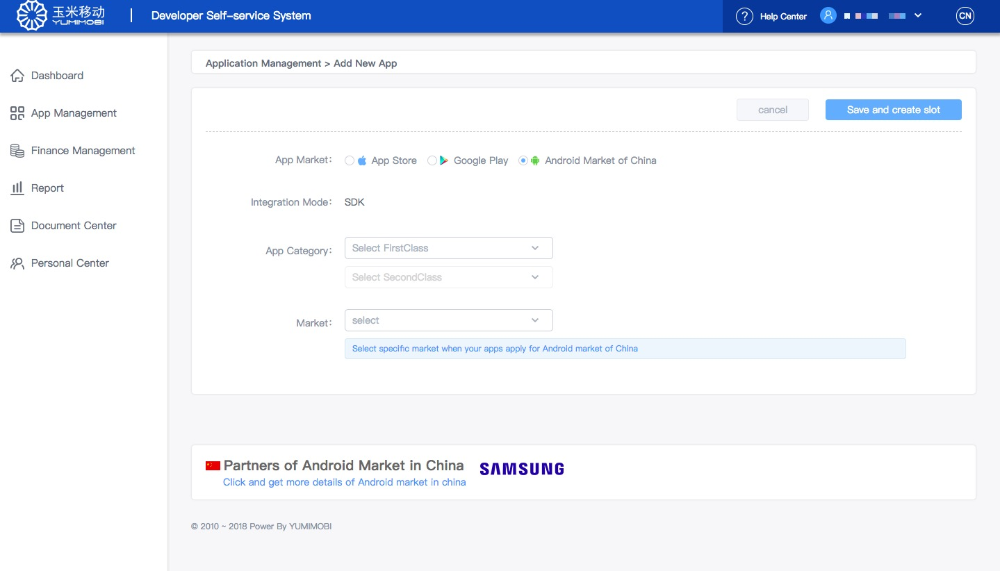
  1).If the market for app is App Store or Google play: fill in the URL to pick up the imformation of app's pakage name and app name.If the app updates in app store,click 'Please click here to update the APP information if the APP is online' to renew the app's latest imformation.
   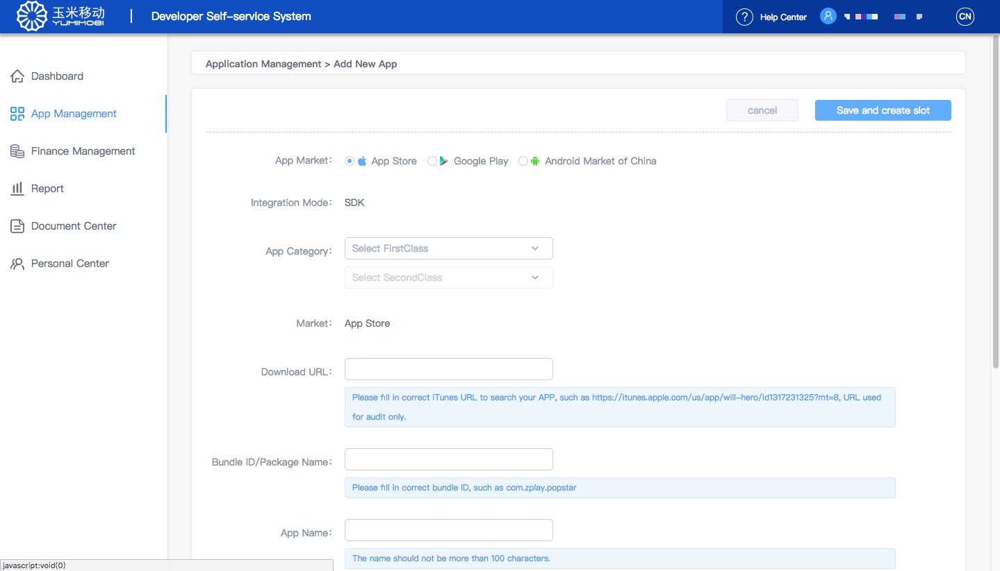
    2). If the market for app is domestic android market ,or the app is not online in App Store or Google play: click 'If the APP is not online, click here to fill in the APP information.'to fill in the fundemental imformation of app ;fill in the fundemental imformation of app .

Step 2：Save the imformation of app craetion and enter the page of creating ad slot,then fill in slot name and select the type of  slot.
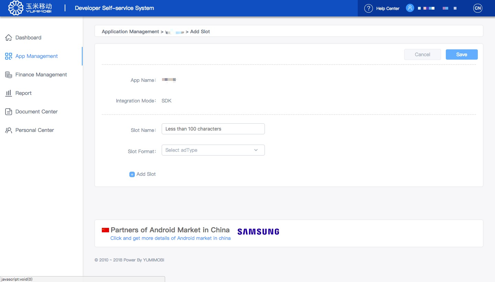
Step 3：There is a relevant slot ID taht you need to add to your app's source code after saving slot imformation. When app is apploved and its slot is under open ,ad requirment and filling will be normally received in order to realize the qulidity function.
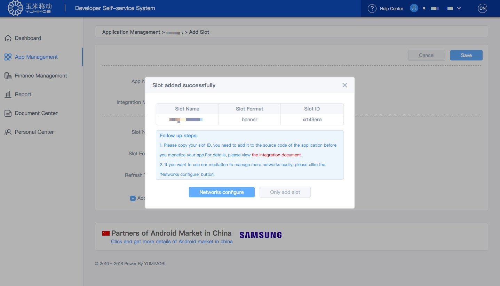

Step 4：Mediation function：
Ad filing effect and qulidity capacity can be better improved by Mediation function; developer should apply for account on third-part platformt of mediation to pick up the relevant parameters;ads shall be required to dispaly according to developer's configured imformation after configuration is saved.
 - In the state of automatic configuration and manual configuration,platform is open on the base of finnished ad paremeters. 
 - By clicking on platform name , you can fill in revelant parameters which are required options;Ad paremeters are used for ad requirement ,incorrect ad paremeters fail to require ads;  report Api paremeters are used for platform statistics,please make them correcet or the date can not be accepted and the effect of automatic order will be affected.
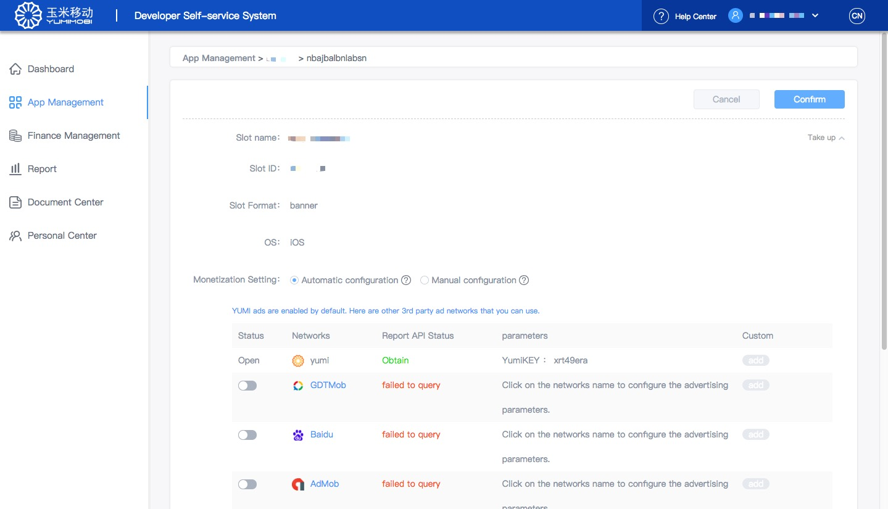

### Three、Document center
- Developer can watch the SDK & SSP API intergraiton document of yumi platform  in document center after creating app successfully,and intergrate imformation with flow to realize liquidity; developer can find out more specific Yumi date by means of Report API intergratiion document .
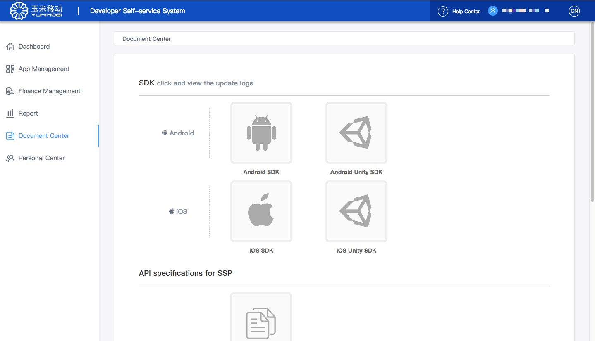

### four、Finnance Management
##### 1.Finnance list
- Developer can check more imformation about finnance rules ,finnance information ,invoice imformation ,monthly revenue record and withdrawable record in details on finnance management page.
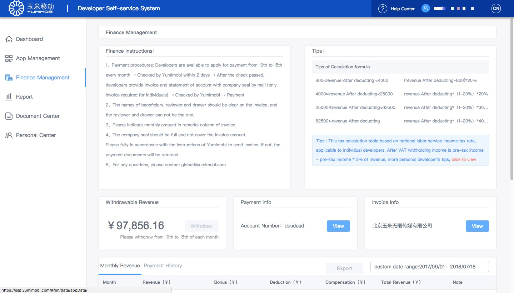

##### 2.Add finnance fundemental imformation添加财务基础信息
1).Withdrawable procedures can be used after developer fill in finnance imformation successfully.
2). Developer must fill in raeal finnance imformation which can not be modified as finnance transfer account.
- when it is a personal account,invoice imformation is dispensable and relevant tax administration is withheld by yumimobi,developer need to upload ID card imformation; when it is a company account,invoice imformation is provided necessarily and relavnat credentials prove of company are requiered to filled in.
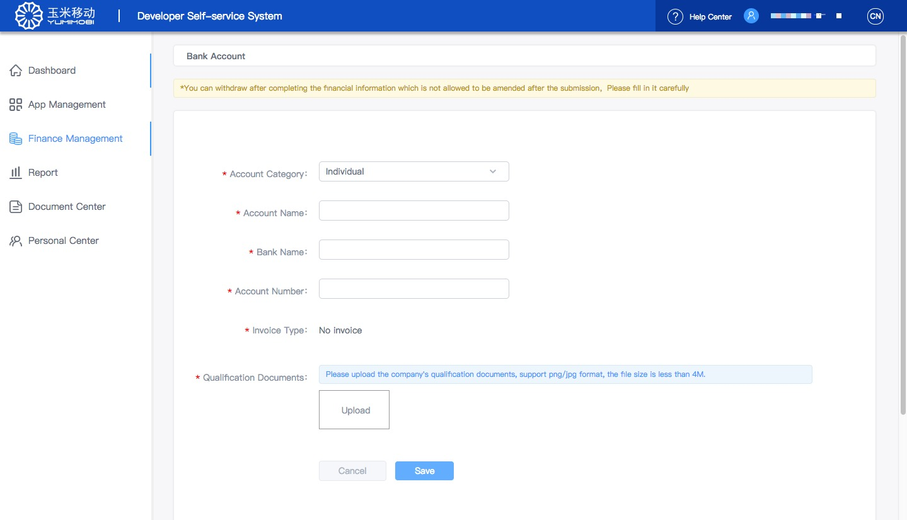
##### 2.Invoice materials
When company fills in invoice imformation ,click check in finnance managment>invoice meterials to receive incoice imformation.

#### 3.Withdraw
- Withdraw：total revenue can be withdrawn once or spearatly before deadline months,developer can check the submitted imformation in withdrawable managment page.
 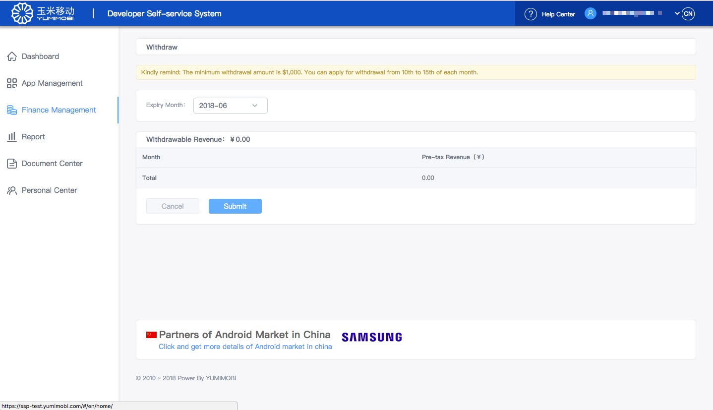

### Five、Date report
1. All date currencies are base on the settle currencies at the time of registration,coverted and estimated in accordance of exchange rate.所
2. Date trend graph：
- By default, all app mediation platforms show nearly one month data trend graph (customizable date), and the effect income, impressions, eCPM three table keys can be switched;
- Platform shows the trend graph of revenue、impression、eCPM  over a period of time respectively;
- If mediation is not configured,there only shows the date from yumi platform.
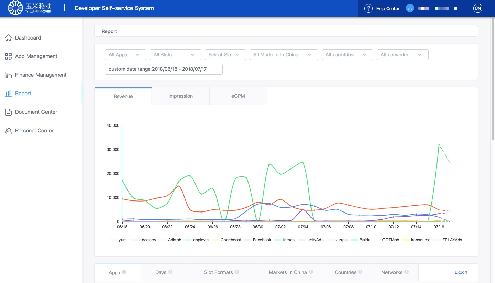

3.List page dispaly date according to the dimensions of app 、 date、ad slot、channel、nation and ad platform;
- The dimensions of app、date、channnel、ad slot and nation display the data from yumi platform；
-  Mediation platform displays the thrid-party platform data through Report API parameters.
- Each data dimension corresponds to one export, click the corresponding export button to export the corresponding report data.
 
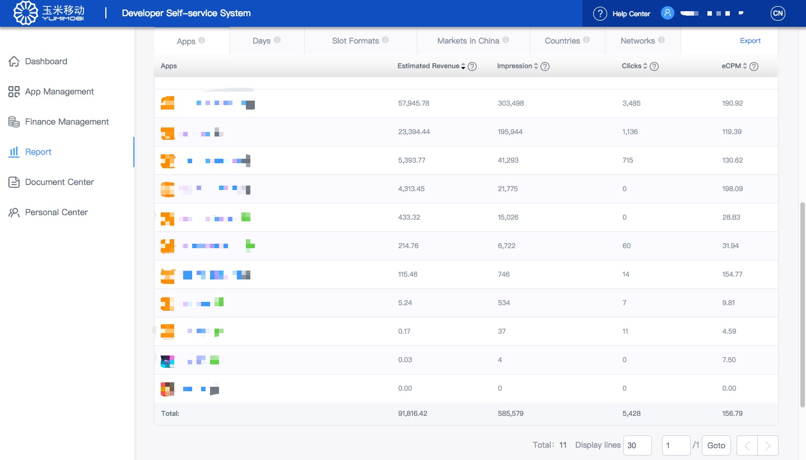

### Six、personal Center
- click the personal center,enter personal center page where shows the imformation you filled in at the time of registration.

### Seven、Partners of Android Market in China 
- Some of Android Market in china have cooperated with YUMI platform about how to help developer to distribute their applications in China. We provide an efficient, simple and new way to help you. You just need set the value of setChannelID(channelStr) to ChannelID which is on behalf of Android market when you integrating YUMI SDK to your applications. YUMI platform will automatically complete attribution analysis for developer and Android market. Click to enter market instruction interface.
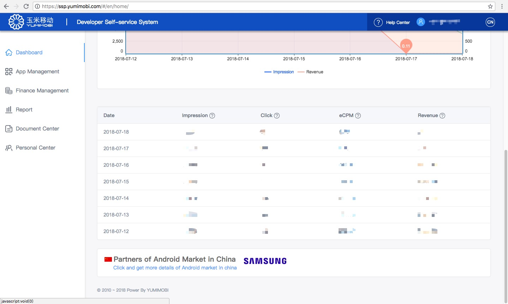

