### 开发者系统使用说明

### 一、首页
开发者登录后，首页界面默认展示最近7天数据，开发者可直观查看最近7天的展示和收入趋势图

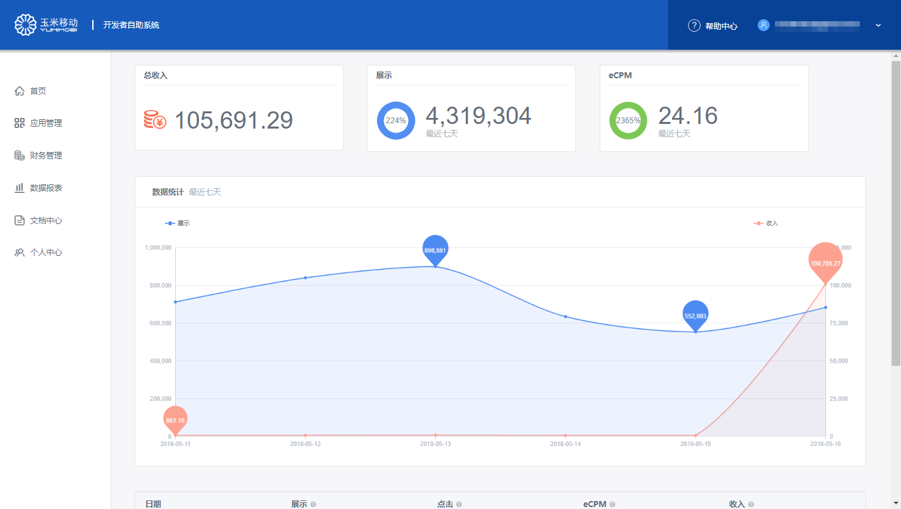
### 二、开发者应用管理
##### 1.开发者应用管理
开发者创建的全部应用信息，均在此页面展示；应用创建后需等待审核，只有审核通过后才可实现流量变现
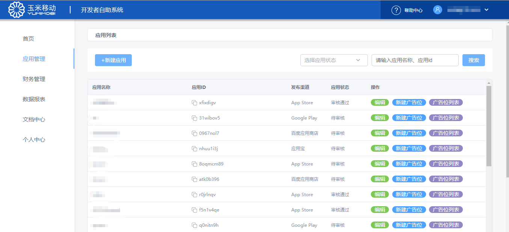

##### 2.创建应用
第一步：点击应用管理列表，点击“新建应用”，进入新建应用界面，填写应用基础信息，保存填写信息进入广告位创建页面；根据商务合作方式选择接入方式，SDK接入或者服务端API接入，不同的接入方式配置逻辑会有所不同；
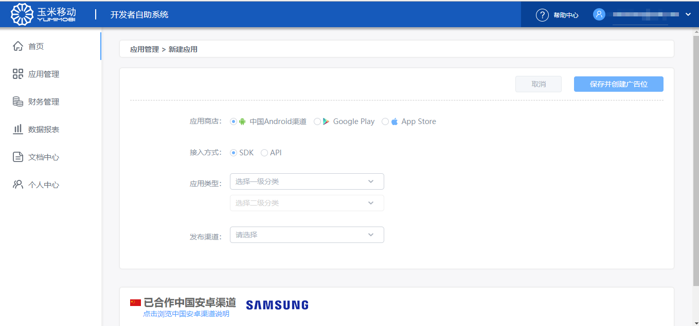
  1). 若应用发布渠道为APP Store或者Google play时：填写渠道链接地址，获取应用包名、名称等基础信息，若该应用在应用商店有所更新，可直接点击“若应用已上线，点击此处更新应用基础信息”，以更新应用最新信息；
   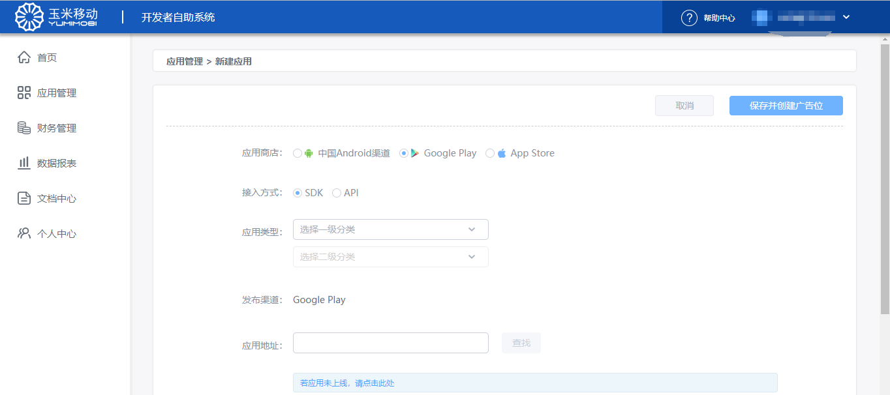
    2). 若应用发布渠道为国内安卓渠道时， 或者未在APP Store或者Google play未发布，可点击“若应用未上线，请点击此处”手动填写应用基础信息；填写应用基础信息；
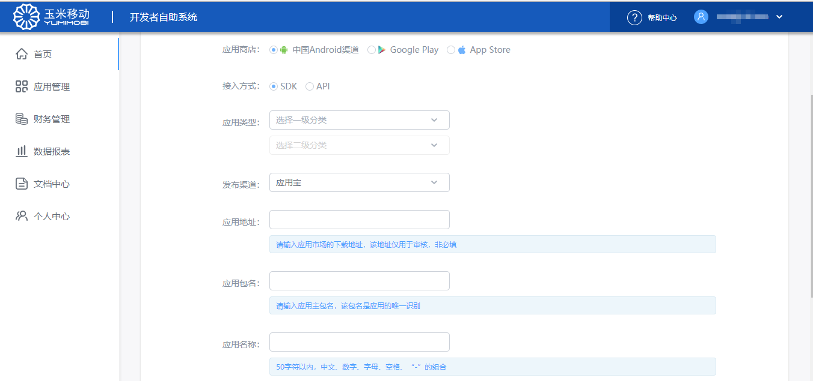
第二步：保存应用创建信息，进入广告位创建页面，填写广告位名称并选择创建广告位类型；
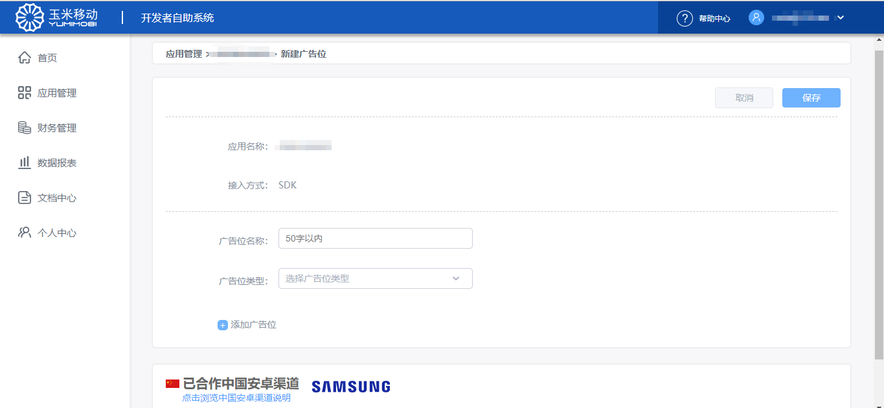
第三步：广告位信息保存后,生成相关广告位ID,该参数需要添加到应用的源代码中，当应用审核通过且广告为开启状态时，即可正常请求和获取到广告填充，实现流量变现功能；
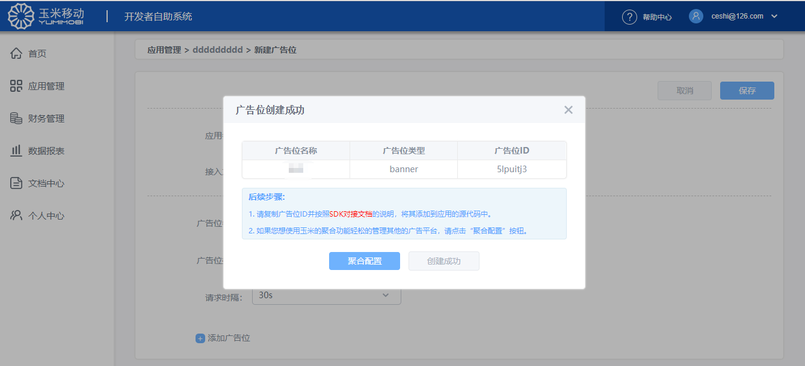

第四步：聚合配置功能：通过聚合配置功能，可更好的提高广告填充效果和变现能力；聚合功能下的三方平台参数需开发者自己去三方平台申请账号，获取相关参数；配置保存后即可按照开发者创建配置信息请求广告；
 - 自动配置或者手动配置下，平台开启均是基于广告参数已经填写
 -  点击平台名称，可以填写相关参数，每个平台的参数均为必填项；广告参数是为了请求广告使用，若填写错误则无法正常获取广告；Report  Api参数是为了获取该平台的数据使用，请正确填写，若数据无法获取，则会影响到自动排序效果
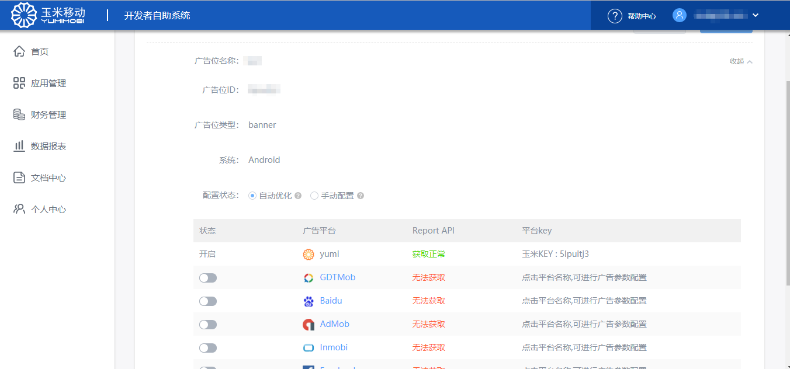

### 三、文档中心
- 开发者应用信息创建成功后，开发者可通过文档中心获取玉米平台SDK& SSP API的接入文档，将相关信息接入到流量中，以实现流量变现；通过Report API接入文档，可获取详细的yumi数据
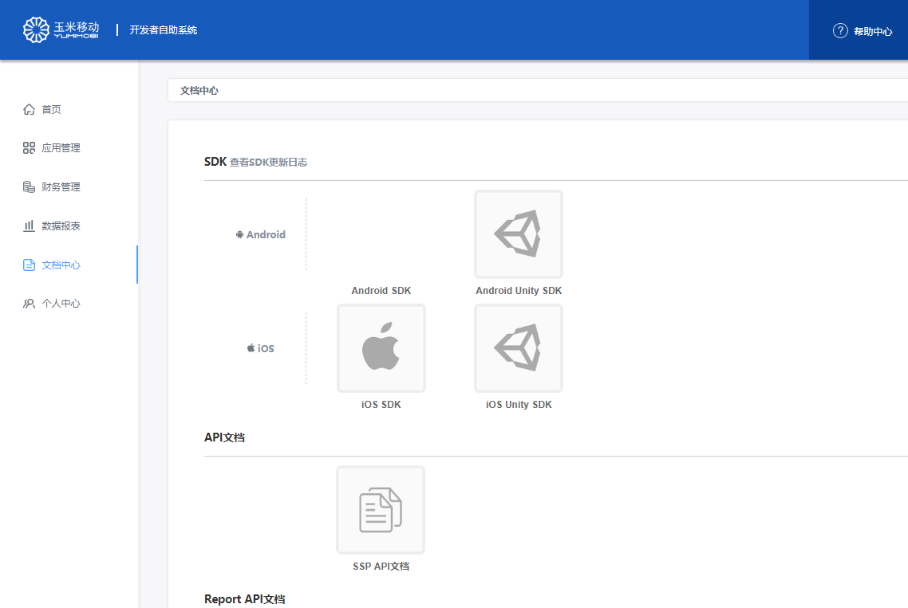

### 四、财务管理
##### 1.财务列表
- 财务管理列表页可查看财务规则说明，财务信息，发票信息，月收入记录，提现记录等详细信息
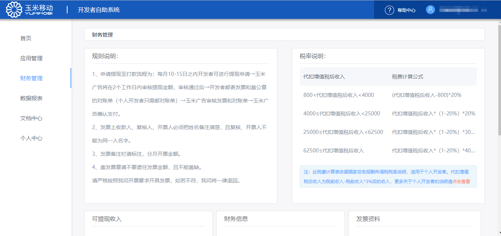

##### 2.添加财务基础信息
1). 开发者填写财务信息成功后，才可进入提现流程
2). 开发者需填写真实的财务信息，此信息填写后不可修改，为财务转账账号；
- 账户类型为个人时，可不提供发票信息，有yumimobi代扣相关税务，需上传身份证等证件信息； 账户类型为公司时，需要提供发票信息，并填写相关企业资质证明
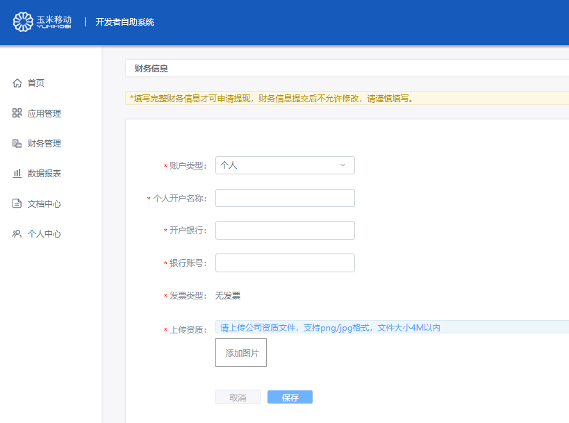
##### 2.发票资料
当公司开据发票信息时，可点击财务管理<发票资料下的查看，获取发票信息
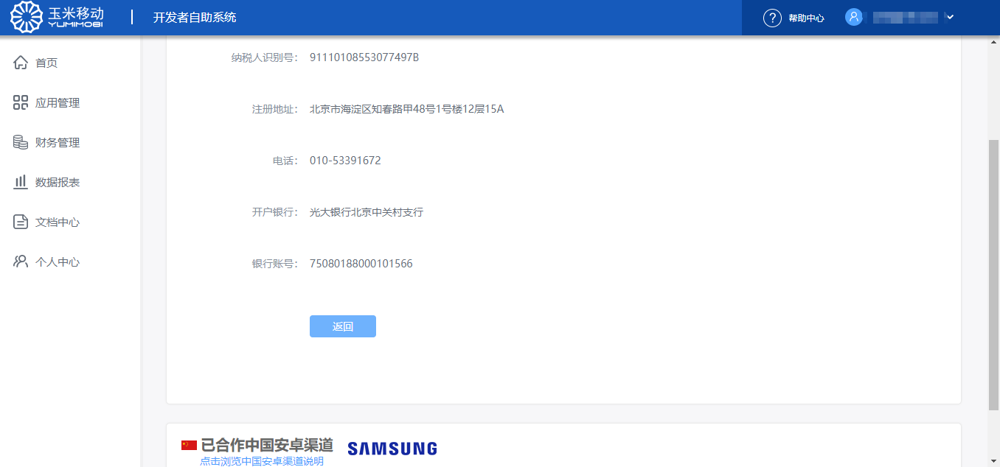
#### 3.提现
- 提现：截止月份前的全部金额，可一次性提出，也可按照月份单独提出，提交后可在提现管理页面查看
 

### 五、数据报表
1. 所有数据币种均基于注册时选择的结算币种，按照汇率进行了转化和预估
2. 数据趋势图：
- 默认展示全部应用聚合联盟平台每天数据趋势图，效果收入、展示次数、eCPM三个table键可进行切换；
- 分平台展示每个平台的收入、展示、eCPM一段时间内的趋势走向图；
- 若未进行聚合配置时，则只展示yumi平台数据
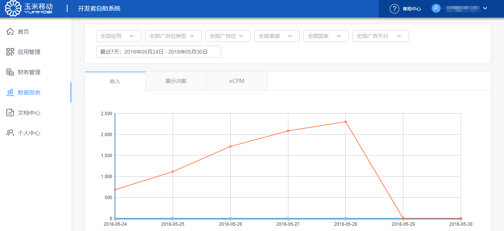

3. 列表页按照应用、日期、广告位、渠道、国家、广告平台数据维度展示数据；
- 其中应用、日期、广告位、国家展示的均为yumi平台数据；
- 聚合平台展示的为通过Report API参数获取的三方平台数据
- 每个数据维度对应一个导出，点击对应导出按钮，可导出对应报表数据
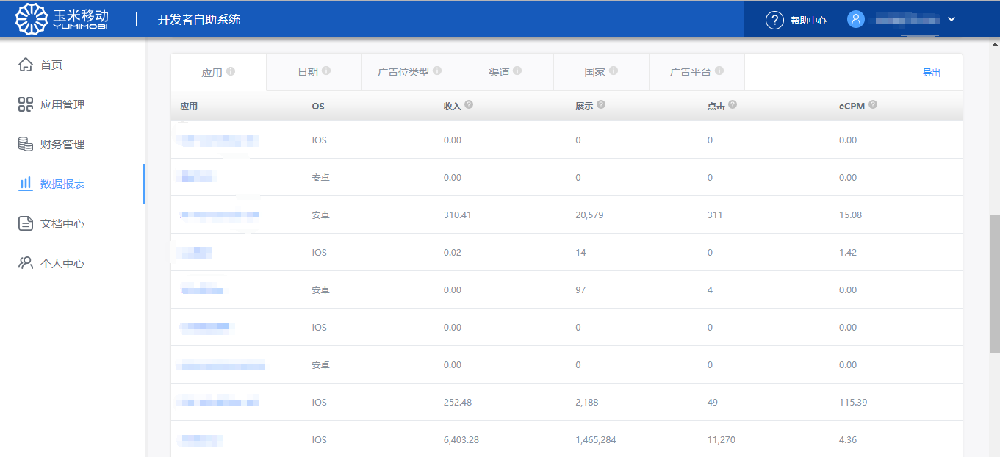

### 六、个人中心
- 点击个人中心，进入个人中心页面，此部分信息为注册时填写信息
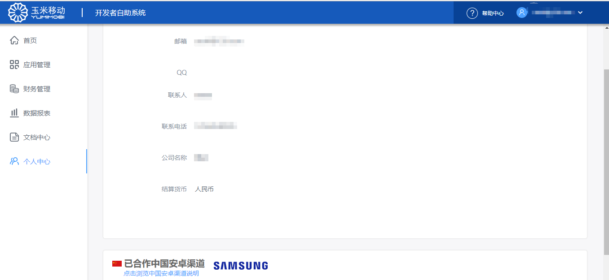

### 七、中国安卓渠道合作
- 玉米已经和部分中国安卓渠道达成了全新的合作方式，开发者在接入yumi SDK时，将setChannelID(channelStr)设置为setChannelID(‘ChannelID’)，YUMI平台自动将应用数据归因到相关渠道，点击可进入渠道说明界面
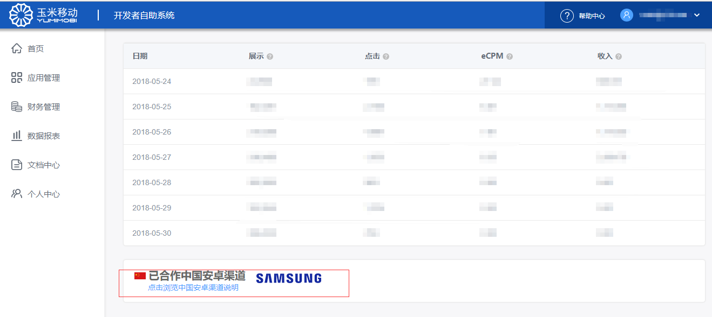

