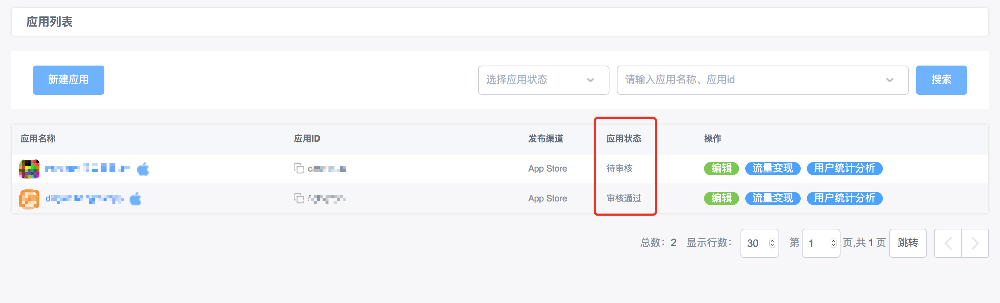
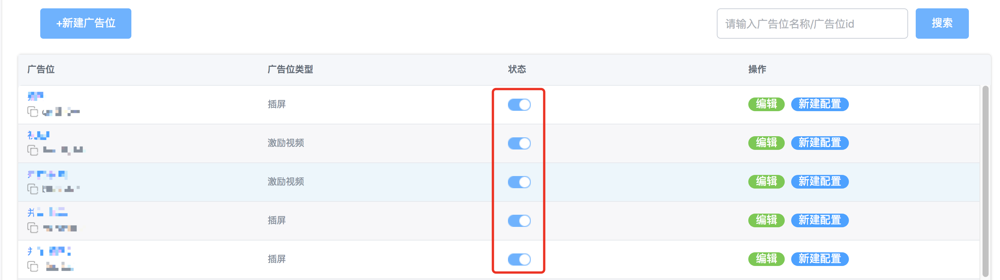
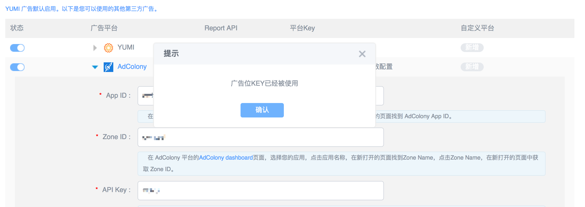
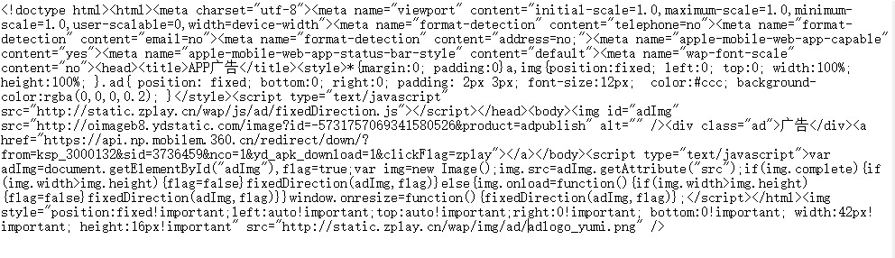
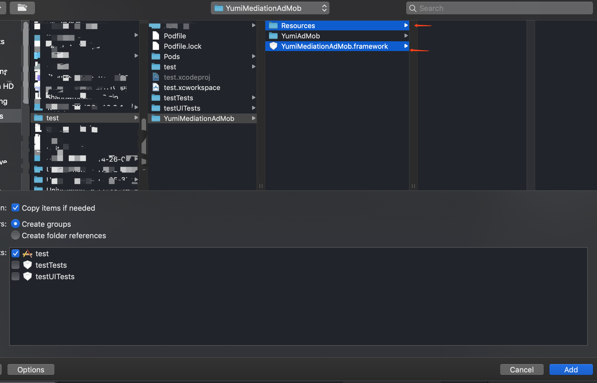

<!-- TOC -->

- [YumiMediationSDK Q&A](#yumimediationsdk-qa)
    - [系统操作相关](#系统操作相关)
        - [应用添加后，在待审核状态时可否进行测试？](#应用添加后在待审核状态时可否进行测试)
        - [如何暂停变现？](#如何暂停变现)
        - [添加或修改配置时，为什么提示“广告位KEY已经被使用”？](#添加或修改配置时为什么提示广告位key已经被使用)
    - [数据统计相关](#数据统计相关)
        - [玉米广告数据及收入更新时间？](#玉米广告数据及收入更新时间)
        - [数据或收入没有按时更新，应如何处理？](#数据或收入没有按时更新应如何处理)
        - [为什么 eCPM 会有波动？](#为什么-ecpm-会有波动)
        - [广告计费方式都有什么？](#广告计费方式都有什么)
    - [SDK 接入相关](#sdk-接入相关)
        - [如何接入 SDK？](#如何接入-sdk)
        - [为什么我没有找到文档中所说的方法？](#为什么我没有找到文档中所说的方法)
        - [在应用更新时，是否需要将玉米聚合SDK更新到最新版本？](#在应用更新时是否需要将玉米聚合sdk更新到最新版本)
        - [为什么我请求不到广告/广告填充率太低？](#为什么我请求不到广告广告填充率太低)
        - [应用不需要区分渠道、版本，ChannelID 和 VersionName 参数如何填写？](#应用不需要区分渠道版本channelid-和-versionname-参数如何填写)
        - [为什么调试模式下，页面有些平台显示为灰色？](#为什么调试模式下页面有些平台显示为灰色)
        - [为什么调试模式下，部分平台未展示？](#为什么调试模式下部分平台未展示)
        - [启动崩溃且崩溃日志中有 AdMob 相关描述时，该如何处理？](#启动崩溃且崩溃日志中有-admob-相关描述时该如何处理)
        - [调用展示广告的方法后游戏为什么没有展示广告？](#调用展示广告的方法后游戏为什么没有展示广告)
        - [如果广告素材存在变形、跳转等问题，如何处理？](#如果广告素材存在变形跳转等问题如何处理)
        - [为什么添加视频广告后游戏卡顿？](#为什么添加视频广告后游戏卡顿)
        - [如何隐藏原生广告的广告标识？](#如何隐藏原生广告的广告标识)
        - [如何控制原生视频声音？](#如何控制原生视频声音)
        - [原生广告有留白问题如何处理？](#原生广告有留白问题如何处理)
        - [iOS 接入时，Firebase SDK 和 AdMob SDK 产生冲突时如何处理？](#ios-接入时firebase-sdk-和-admob-sdk-产生冲突时如何处理)
        - [为什么 Android 系统下，没有做任何操作，插屏自动展示了？](#为什么-android-系统下没有做任何操作插屏自动展示了)
        - [Android 系统如何解决资源冲突问题？](#android-系统如何解决资源冲突问题)
        - [如何适配 Android 9.0 系统？](#如何适配-android-90-系统)
        - [GDT (广点通)平台使用 Android Studio 接入原生广告，为什么原生视频广告不显示？](#gdt-广点通平台使用-android-studio-接入原生广告为什么原生视频广告不显示)
        - [Android 打包时方法数超过 65535 ，导致无法打包，如何处理？](#android-打包时方法数超过-65535-导致无法打包如何处理)
        - [使用 Unity 插件接入 Android 应用时报错 "Failed to find Build Tools…" 如何处理？](#使用-unity-插件接入-android-应用时报错-failed-to-find-build-tools-如何处理)
        - [使用 Unity 插件接入 Android 应用时报错 "No toolchains found…" 如何处理？](#使用-unity-插件接入-android-应用时报错-no-toolchains-found-如何处理)
        - [使用 Unity 插件接入 Android 应用时报错 "Failed to apply plugin…" 如何处理？](#使用-unity-插件接入-android-应用时报错-failed-to-apply-plugin-如何处理)
    - [附录](#附录)
        - [三方平台测试 ID](#三方平台测试-id)
            - [iOS 测试 ID](#ios-测试-id)
            - [Android 测试 ID](#android-测试-id)

<!-- /TOC -->


# YumiMediationSDK Q&A
## 系统操作相关
### 应用添加后，在待审核状态时可否进行测试？
应用未审核通过时，不能进行测试。您可以使用测试 ID（点击查看 [iOS 测试 ID](https://github.com/yumimobi/YumiMediationSDKDemo-iOS/blob/master/normalDocuments/YumiMediationSDK%20for%20iOS(zh-cn).md#test-id)、[Android 测试 ID](https://github.com/yumimobi/YumiMediationSDKDemo-Android/blob/master/docs/YumiMediationSDK%20for%20Android(zh-cn).md#52-%E6%B5%8B%E8%AF%95%E5%B9%BF%E5%91%8A%E4%BD%8D)）进行测试，测试 ID 不会产生广告收入。

  

### 如何暂停变现？
[开发者自助系统](https://ssp.yumimobi.com/?&oauth=dev_oauth#/app/appList/)提供广告位关闭功能，点击关闭按钮可以暂时关闭广告位，再次点击可以重新开启广告位；暂停广告位将直接影响到应用收入效果，请慎重操作。
  

### 添加或修改配置时，为什么提示“广告位KEY已经被使用”？
同一个三方广告平台的广告位 KEY 仅能配置到一个应用上。请明确您希望在哪个应用下使用该 KEY，并关闭另外一个应用下的该平台配置，或修改另外一个应用下的广告位 KEY。如果您无法找到使用了该 KEY 的应用，可通过 global@yumimobi.com 联系我们。
  

## 数据统计相关
### 玉米广告数据及收入更新时间？
数据实时展示（有 2~3 小时延迟），广告收入次日 16:30 展示。

### 数据或收入没有按时更新，应如何处理？
我们的数据偶尔会有延迟，请耐心等待；如较长时间仍未看到数据，可通过给 global@yumimobi.com 发送邮件反馈问题。

### 为什么 eCPM 会有波动？
eCPM 的波动由 CTR 和 CPC 决定，大多数情况下，CTR 基本保持稳定；CPC 的波动主要是由于广告竞争情况的变化引起，在不同时间段广告主投放预算会对大盘的 CPC 有所影响。如果某个时期大盘流量增长过快，可能会因为广告主竞价不充分而影响到 eCPM。

### 广告计费方式都有什么？
目前，我们有 CPC(点击计费)和 CPM(千次广告展示计费)两种计费方式，以后者为主。

## SDK 接入相关
### 如何接入 SDK？
请参考我们的[接入文档](http://doc.ssp.yumimobi.com/IntegrateGuide/index)。

### 为什么我没有找到文档中所说的方法？
当您没有找到文档中所说的方法时，很有可能是由于您接入使用的 SDK 版本过老。为了给您带来更多收益，请接入最新的 SDK。点击查看[接入文档](http://doc.ssp.yumimobi.com/IntegrateGuide/index)。

### 在应用更新时，是否需要将玉米聚合SDK更新到最新版本？
为了保证广告收益，应用更新时，请使用最新版本玉米聚合SDK。您可通过查看更新日志（点击查看 [iOS 更新日志](https://github.com/yumimobi/YumiMediationSDKDemo-Android/blob/master/SDK%20Changelog/iOS%20SDK%E6%9B%B4%E6%96%B0%E6%97%A5%E5%BF%97.md)、[Android 更新日志](https://github.com/yumimobi/YumiMediationSDKDemo-Android/blob/master/SDK%20Changelog/Android%20SDK%E6%9B%B4%E6%96%B0%E6%97%A5%E5%BF%97.md
)）了解每个版本具体更新内容。

### 为什么我请求不到广告/广告填充率太低？

请求不到广告有多种原因，请明确您的问题出现在哪个操作系统，并参考以下信息进行排查：

1. 普遍原因
  - 包名不一致。请保证您在[开发者自助系统](https://ssp.yumimobi.com/?&oauth=dev_oauth#/app/appList/)中填写的包名和您应用中使用的包名一致，否则有可能请求不到广告。
  - 您的应用未审核通过。未审核通过的应用，无法请求到广告。您在调试过程中可以使用我们的测试 ID 进行测试。点击查看：[iOS 测试 ID](https://github.com/yumimobi/YumiMediationSDKDemo-iOS/blob/master/normalDocuments/YumiMediationSDK%20for%20iOS(zh-cn).md#test-id)、[Android 测试 ID](https://github.com/yumimobi/YumiMediationSDKDemo-Android/blob/master/docs/YumiMediationSDK%20for%20Android(zh-cn).md#52-%E6%B5%8B%E8%AF%95%E5%B9%BF%E5%91%8A%E4%BD%8D)
  - 如果您的应用已审核通过，并且您想使用正式的广告位 ID 进行测试，但没有广告填充，您可以使用三方平台的测试应用中提供的测试 ID，具体见[附录-三方平台测试 ID](#三方平台测试-id)；
  - 请注意 Facebook 在中国大陆填充较差，在中国大陆调试 Facebook 广告时，您需要：
    - 开启 VPN 至中国大陆以外的国家或地区。
    - 保持 Facebook App 处于登录状态。如果填充仍然较差，您可以参考 [Facebook 测试文档](https://developers.facebook.com/docs/audience-network/testing)，开启测试模式。测试模式下，Facebook 有足量的填充。

2. iOS 需核查的内容
  - 请确认 ATS 的设置状态。WWDC 15 提出的 ATS (App Transport Security) 是 Apple 在推进网络通讯安全的一个重要方式。在 iOS 9 及以上版本中，默认非 HTTPS 的网络访问是被禁止的。请参考[ iOS 接入文档- App Transport Security](https://github.com/yumimobi/YumiMediationSDKDemo-iOS/blob/master/normalDocuments/YumiMediationSDK%20for%20iOS(zh-cn).md#app-transport-security) 进行设置。

3. Android 需核查的内容
  - Android 6.0 及以上的系统（targetSdkVersion 为 23 或以上时）需要手动添加代码以获取用户授权。Yumi SDK 提供了以下方法进行权限检查并弹窗提醒用户授权：
   
      ```java
      YumiSettings.runInCheckPermission(true);
      ```

    该方法的默认参数为 false。当其为 false 时，Yumi SDK 不会对用户进行权限提示。当其为 true 时，Yumi SDK 会进行权限检查并且弹窗提示用户授权。您需要在实例化广告之前调用该方法。

    注：如果将参数设置为 true 后，仍然无法看到权限请求弹窗，请检查您的项目中是否有 support-v4 包。

  - 百度平台需要额外的权限以下发广告。若您接入百度平台时发现没有广告填充，请检查是否有以下权限：
      ```xml
      <uses-permission android:name="android.permission.READ_PHONE_STATE" />
      <uses-permission android:name="android.permission.WRITE_EXTERNAL_STORAGE" />
      <uses-permission android:name="android.permission.ACCESS_COARSE_LOCATION" />
      ```
  
  - 广点通平台需要额外的权限以下发广告。若您接入广点通平台时发现没有广告填充，请检查是否有以下权限：

      ```xml
      <uses-permission android:name="android.permission.READ_PHONE_STATE" />
      <uses-permission android:name="android.permission.ACCESS_COARSE_LOCATION" />
      <uses-permission android:name="android.permission.ACCESS_FINE_LOCATION" /> 
      <uses-permission android:name="android.permission.WRITE_EXTERNAL_STORAGE" />
      <uses-permission android:name="android.permission.REQUEST_INSTALL_PACKAGES" />
      ```

### 应用不需要区分渠道、版本，ChannelID 和 VersionName 参数如何填写？
应用接入过程中不需要区分渠道、版本，接入过程中渠道版本直接填空即可；如需要区分不同渠道版本效果，可直接填写对应参数值；以banner为例：消灭星星510版本需要发版到华为渠道，可填写banner.setChannelID("huawei")；banner.setVersionName("5.1.0");

### 为什么调试模式下，页面有些平台显示为灰色？
在[开发者自助系统](https://ssp.yumimobi.com/?&oauth=dev_oauth#/app/appList/)中配置没有打开的平台，会在该页面显示为灰色。请将该平台配置到这个广告位上。
  

### 为什么调试模式下，部分平台未展示？
没有在代码里接入的平台，不会显示在该页面中。若想测试某平台，请确保已经在代码里接入。
  

### 启动崩溃且崩溃日志中有 AdMob 相关描述时，该如何处理？
- iOS 接入：请参考 [AdMob iOS 接入文档](https://developers.google.com/admob/ios/quick-start?hl=zh-cn)的关于 info.plist 文件的相关说明；
- Android 接入：请参考 [AdMob Android 接入文档](https://developers.google.com/admob/android/quick-start?hl=zh-cn)关于 AndroidManifest.xml 文件的相关说明。

### 调用展示广告的方法后游戏为什么没有展示广告？
调用展示方法后，广告未展示有两种可能：
1. 广告未准备完成。请监听广告准备好的回调。待广告准备好之后，再调用展示广告的方法；
2. 广告已经准备完成，但是在调用展示方法之后又立刻请求下一条广告，导致原来已经准备好的广告会被销毁，因此广告无法展示。为避免此问题，请不要在广告展示过程中请求下一条广告。

### 如果广告素材存在变形、跳转等问题，如何处理？
请给 global@yumimobi.com 发送邮件并提供素材截图、关键字、物料内容、素材跳转链接。

物料示例如下：
  
  

### 为什么添加视频广告后游戏卡顿？
游戏卡顿可能是由于您调用 isReady() 或 isMediaPrepared() 方法过于频繁。我们建议您每5秒钟调用一次，如果调用不加频次控制可能会导致内存占用增加，游戏卡顿。

### 如何隐藏原生广告的广告标识？
Yumi SDK 中提供了隐藏原生广告中的广告标识的接口，具体可见：[iOS 接入文档 - 原生广告选项](https://github.com/yumimobi/YumiMediationSDKDemo-iOS/blob/master/normalDocuments/YumiMediationSDK%20for%20iOS(zh-cn).md#%E5%8E%9F%E7%94%9F%E5%B9%BF%E5%91%8A%E9%80%89%E9%A1%B9-yumimediationnativeadconfiguration)及 [Android 接入文档 - 其他设置](https://github.com/yumimobi/YumiMediationSDKDemo-Android/blob/master/docs/YumiMediationSDK%20for%20Android(zh-cn).md#354-%E5%85%B6%E5%AE%83%E8%AE%BE%E7%BD%AE)。

### 如何控制原生视频声音？
由于三方 SDK 没有提供控制视频声音的接口，目前无法控制原生视频声音。


### 原生广告有留白问题如何处理？
如果希望您收到的物料填满 View，可通过以下方法：

iOS: 
```objective-c
imageView.contentMode = UIViewContentModeScaleToFill;
```
Android:
```java
imageView.setScaleType(ImageView.ScaleType.FIT_XY);
```

如果使用该方法后，物料产生了拉伸，请通过 global@yumimobi.com 联系我们，请在邮件中说明您的广告位ID及请求时的尺寸。我们将调整并下发合适的物料。

### iOS 接入时，Firebase SDK 和 AdMob SDK 产生冲突时如何处理？
由于 Firebase SDK 中的文件和 AdMob 广告 SDK 代码重复造成冲突，请通过手动的方式接入 AdMob 平台。具体步骤如下：
1. 在 `YumiMediationAdapters`  中删除 AdMob 平台
2. 在 Podfile 中加入 Firebase 的 AdMob 库

   ```ruby
   pod 'Firebase/AdMob'
   ```

   在终端执行 ```pod install``` 完成 Firebase 的 AdMob 库的安装 

3. 手动导入 YumiMediationAdMob （Yumi 的 AdMob adapter）
   （1）在 [SDKDownloadPage-iOS](https://github.com/yumimobi/YumiMediationSDKDemo-iOS/blob/master/normalDocuments/iOSDownloadPage.md) 页面中的AdMob部分下载 Yumi 的AdMob adapter
   （2）将 Resources 和 YumiMediationAdMob.framework 导入 Xcode 工程 （无需导入其他文件）
   
   

### 为什么 Android 系统下，没有做任何操作，插屏自动展示了？
showInterstitial(false) 方法中的参数代表了是否自动展示，如果填 true，则在插屏广告准备完成后就会自动展示。如果不希望插屏自动展示，请将该参数设置为 false。详情请参考文档[展现插屏广告](https://github.com/yumimobi/YumiMediationSDKDemo-Android/blob/master/docs/YumiMediationSDK%20for%20Android(zh-cn).md#322-%E5%B1%95%E7%A4%BA%E5%8F%8A%E9%94%80%E6%AF%81)相关内容。


### Android 系统如何解决资源冲突问题？
1. 查看控制台输出错误日志，查看出现冲突的资源；
2. 在项目中查找哪些库加载了此资源；
3. 如果在第 2 步找到的库不是项目直接引用的库，可以使用 `./gradlew app:dependencies > dependencies.txt`命令将项目依赖输出到 dependencies.txt 文件中，然后从该文件中找到冲突资源；
4. 去除重复资源。

### 如何适配 Android 9.0 系统？
目前一些平台的 Android SDK 暂不支持 Android 9.0 及以上操作的系统，比如 Mintegral 平台。如果在 Android 9.0 以上系统中出现崩溃，可将 targetSDKversion 设置为 27 或者 27 以下，即可解决问题。

### GDT (广点通)平台使用 Android Studio 接入原生广告，为什么原生视频广告不显示？
如果您使用 Android Studio 接入 GDTMob (广点通)平台，请确保 app 的 AndroidManifest.xml 中的 package:"xxx.xxx.xxx" 名称和 build.gradle 文件中的 applicationId "xxx.xxx.xxx" 保持一致。如下图所示：


### Android 打包时方法数超过 65535 ，导致无法打包，如何处理？
可以通过 [Google 官方推荐](https://developer.android.com/studio/build/multidex)的 multidex 包进行多 dex 编译的方法避免，步骤如下：

（1） 导入 multidex 包，设置为支持多 dex 输出模式 
```groovy
defaultConfig {   
        applicationId "XXX"
        minSdkVersion 16
        targetSdkVersion 28
        multiDexEnabled true
}

dependencies {
        compile 'com.android.support:multidex:1.0.3'
 }
```
（2） 在 Application 类中添加以下方法：
```java
@Override
protected void attachBaseContext(Context base) {
       super.attachBaseContext(base);
       MultiDex.install(this);
}
```

### 使用 Unity 插件接入 Android 应用时报错 "Failed to find Build Tools…" 如何处理？
报错信息：
   ```
   * What went wrong:
   A problem occurred configuring root project 'gradleOut'.
   > Failed to find Build Tools revision 29.0.0
   ```
解决方法:
从 [mainTemplet](https://github.com/yumimobi/YumiMediationSDK-Unity/blob/master/Assets/Plugins/Android/mainTemplate.gradle) 中删除 `buildToolsVersion '**BUILDTOOLS**'` 

### 使用 Unity 插件接入 Android 应用时报错 "No toolchains found…" 如何处理？
报错信息：
   ```
   * What went wrong:
   A problem occurred configuring root project 'gradleOut'.
   > No toolchains found in the NDK toolchains folder for ABI with prefix: mips64el-linux-android
   ```
解决方法:
修改 [mainTemplet](https://github.com/yumimobi/YumiMediationSDK-Unity/blob/master/Assets/Plugins/Android/mainTemplate.gradle) 中 gradle plugin 版本，如将 `classpath 'com.android.tools.build:gradle:3.0.1'` 修改为 `classpath 'com.android.tools.build:gradle:3.2.1'`。

### 使用 Unity 插件接入 Android 应用时报错 "Failed to apply plugin…" 如何处理？
报错信息：
   ```
   * What went wrong:
   A problem occurred evaluating root project 'gradleOut'.
   > Failed to apply plugin [id 'com.android.application']
      > Minimum supported Gradle version is 4.6. Current version is 4.2.1. If using the gradle wrapper, try editing the distributionUrl in
   ```
解决方法（以下方法任选一个即可）：
- 升级 gradle 版本。根据错误信息中的 "Minimum supported Gradle version is…" 将 gradle 版本升级至该版本。以上述错误信息为例，将 gradle 版本升级为 4.6 后即可解决问题；
- 降低 gradle plugin 版本。请按照以下步骤操作：
  （1） 根据错误信息中的 "Current version is…" 明确当前使用的 gradle 版本。以上述错误信息为例，当前的 gradle 版本为 4.2.1
  （2） 根据 [Update Gradle](https://developer.android.com/studio/releases/gradle-plugin#updating-gradle) 文档，明确当前使用的 gradle 版本对应的 gradle plugin 版本。以上述错误信息为例，当前的 gradle 版本对应的 gradle plugin 版本为 3.0.0+
  （3） 将 gradle plugin 版本降至上一步中查询到的 gradle plugin 版本。以上述错误信息为例，应将 [mainTemplet](https://github.com/yumimobi/YumiMediationSDK-Unity/blob/master/Assets/Plugins/Android/mainTemplate.gradle) 中 `classpath 'com.android.tools.build:gradle:x.x.x'` 修改为 `classpath 'com.android.tools.build:gradle:3.0.0+'`


## 附录
### 三方平台测试 ID
如果您在调试过程中，使用正式的三方平台 ID 没有填充，可以使用以下三方平台的测试 ID 进行配置。这些测试 ID 是三方平台的测试 Demo 中提供的测试 ID，如果该 ID 没有广告填充，可以联系三方平台。请注意：同一个三方广告平台的测试广告位 KEY 仅能配置到一个应用上。请明确您希望调试哪个应用，并避免在其他应用下配置相同的测试广告位 KEY。
#### iOS 测试 ID
1. Banner

|平台|参数一|参数二|
|-|-|-|-|
|AdMob|详情查看 [AdMob 测试广告](https://developers.google.com/admob/ios/test-ads)|||
|Baidu|应用 ID：ccb60059|代码位 ID：3722589||
|穿山甲|应用 ID：5000546|代码位 ID：900546859||
|Facebook|Placement ID: YOUR_PLACEMENT_ID|||
|GDTMob|媒体 ID：1105344611|广告位 ID：1080958885885321||
|IQzone|Placement ID: eEZBeUY3ajRRUWM1MW5rZWpEYjB5WHZOZUR1UXJua0doa1dPS2Fha0Rsd2hCRElz|||
|Inneractive|App ID: 102960|Spot ID: 150942|| 


2. 插屏

|平台|参数一|参数二|参数三|
|-|-|-|-|
|AdMob|详情查看 [AdMob 测试广告](https://developers.google.com/admob/ios/test-ads)|||
|穿山甲|应用 ID：5000546|代码位 ID：900546941||
|Chartboost|应用 ID：5b9b2c8d61c3570e1974a657|应用签名：43b4fcee44c0ca91b13ca2724fb0df124377248f||
|Facebook|Placement ID: YOUR_PLACEMENT_ID|||
|GDTMob|媒体 ID：1105344611|广告位 ID：1050652855580392||
|IronSource|App Key: 8545d445|Instance Id: 0||
|InMobi|APP ID: 4028cb8b2c3a0b45012c406824e800ba|Placement ID: 1446377525790||
|IQzone|Placement ID: ZjlVZnFtcVFhQ1ZpWFpzS295MVBSQjlZWmNJUVQyekpEZllxbUhtU21yTFZwSzFz|||
|Mintegral|应用 ID：92763|APP Key: 936dcbdd57fe235fd7cf61c2e93da3c4|广告位 ID：21321|
|UnityAds|Game ID: 14850|Placement ID: video||
|Vungle|应用 ID：58a278a658c8501e56000127|奖励广告 广告位置参考ID：IOSTEST26212|插屏式 广告位置参考ID：IOSTEST35317|
|ZPLAYAds|应用 ID：A650AB0D-7BFC-2A81-3066-D3170947C3DA|广告位 ID：0868EBC0-7768-40CA-4226-F9924221C8EB||
|Inneractive|App ID: 102960|Spot ID: 150946||

3. 激励视频

|平台|参数一|参数二|参数三|
|-|-|-|-|
|AdColony|App ID: appbdee68ae27024084bb334a |Zone ID: vzf8e4e97704c4445c87504e||
|AdMob|详情查看 [AdMob 测试广告](https://developers.google.com/admob/ios/test-ads)|||
|Baidu|应用 ID：ccb60059|代码位 ID：5889473||
|穿山甲|应用 ID：5000546|代码位 ID：900546826||
|Facebook|Placement ID: YOUR_PLACEMENT_ID|||
|GDTMob|媒体 ID：1105344611|广告位 ID：8020744212936426||
|IronSource|App Key: 8545d445|Instance Id: 0||
|IQzone|Placement ID: cnlWVXNOUXliczRPSlBOWjQ5dllMVTd1dlVMTEZtK1ZKWkZ1dTJVVkFvdHlpenh6|||
|Tapjoy|SDK密钥: E7CuaoUWRAWdz_5OUmSGsgEBXHdOwPa8de7p4aseeYP01mecluf-GfNgtXlF |Placement: video_unit ||
|Mintegral|应用 ID：92763|APP Key: 936dcbdd57fe235fd7cf61c2e93da3c4|广告位 ID：21319|
|UnityAds|Game ID: 14850|Placement ID: rewardedVideo||
|Vungle|应用 ID：58a278a658c8501e56000127|奖励广告 广告位置参考ID：IOSTEST26212|插屏式 广告位置参考ID：IOSTEST35317|
|ZPLAYAds|应用 ID：A650AB0D-7BFC-2A81-3066-D3170947C3DA|广告位 ID：BAE5DAAC-04A2-2591-D5B0-38FA846E45E7||
|Inneractive|App ID: 110038|Spot ID: 199508||

4. 原生

|平台|参数一|参数二|
|-|-|-|
|AdMob|详情查看 [AdMob 测试广告](https://developers.google.com/admob/ios/test-ads)|
|Baidu|应用 ID：ccb60059|代码位 ID：2058621|
|穿山甲|应用 ID：5000546|代码位 ID：900546910|
|Facebook|Placement ID: YOUR_PLACEMENT_ID|
|GDTMob|媒体 ID：1105344611|广告位 ID：3050349752532954|

5. 开屏

|平台|参数一|参数二|
|-|-|-|
|AdMob|详情查看 [AdMob 测试广告](https://developers.google.com/admob/ios/test-ads)|||
|Baidu|应用 ID：ccb60059|代码位 ID：2058492|
|穿山甲|应用 ID：5000546|代码位 ID：800546808|
|GDTMob|媒体 ID：1105344611|广告位 ID：9040714184494018|

#### Android 测试 ID
1. Banner

|平台|参数一|参数二|参数三|
|-|-|-|-|
|AdMob|详情查看 [AdMob 测试广告](https://developers.google.com/admob/android/test-ads)|||
|Baidu|应用 ID：e866cfb0|代码位 ID：2015351||
|穿山甲|应用ID：5001121|代码位ID：901121987 |
|Facebook|Placement ID：YOUR_PLACEMENT_ID|
|GDTMob|媒体 ID：1101152570|广告位 ID：4080052898050840||
|IQzone|Placement ID: UkJ1RVVoQmxOQkdub0RaWFFoVjVYNTRHRHVEQlJycWVacEZBQnppbitZdzEwcThY|||


2. 插屏

|平台|参数一|参数二|参数三|
|-|-|-|-|
|AdMob|详情查看 [AdMob 测试广告](https://developers.google.com/admob/android/test-ads)|||
|Baidu|应用 ID：e866cfb0|代码位 ID：2403633||
|穿山甲|应用ID：5001121 |代码位ID：901121725 |
|Facebook|Placement ID：YOUR_PLACEMENT_ID|
|GDTMob|媒体 ID：1101152570|广告位 ID：3040652898151811||
|IronSource|App Key: 85460dcd|Instance Id: 0||
|IQzone|Placement ID: Qjd3TytYVllmRmhTYkp3Ri8yanVHTWNuUDBSSElmdXVoTkcyVTR0WkhRc054M0gv|||
|Mintegral|应用ID：92762|APP Key：936dcbdd57fe235fd7cf61c2e93da3c4|广告位ID：21312|
|UnityAds|Game ID: 1306584|Placement ID: video||
|ZPLAYAds|应用 ID：5C5419C7-A2DE-88BC-A311-C3E7A646F6AF|广告位 ID：19393189-C4EB-3886-60B9-13B39407064E||

3. 激励视频

|平台|参数一|参数二|参数三|
|-|-|-|-|
|AdColony|App ID: app185a7e71e1714831a49ec7|Zone ID: vz1fd5a8b2bf6841a0a4b826|
|AdMob|详情查看 [AdMob 测试广告](https://developers.google.com/admob/android/test-ads)|||
|Baidu|应用 ID：e866cfb0|代码位 ID：5925490||
|穿山甲|应用ID：5001121 |代码位ID：901121365 |
|Facebook|Placement ID：YOUR_PLACEMENT_ID|
|GDTMob|媒体 ID：1101152570|广告位 ID：2090845242931421||
|IronSource|App Key: 85460dcd|Instance Id: 0||
|Inneractive|App ID：110039 |Spot ID：199510 |
|IQzone|Placement ID: MFllRXhOZ1Nnbi9ycVQ2emRCVW1hdlI2SlZ2bzB4WVc4SWZFUUJCb0EzTW8xRXlw|||
|Mintegral|应用ID：92762 |APP Key：936dcbdd57fe235fd7cf61c2e93da3c4|广告位ID：21310 |
|Oneway|Publish ID：a55f21d928b741a3|Placement ID：KXC1TEQ3PV0QBCC3|
|UnityAds|Game ID: 1306584|Placement ID: rewardedVideo||
|ZPLAYAds|应用 ID：5C5419C7-A2DE-88BC-A311-C3E7A646F6AF|广告位 ID：3FBEFA05-3A8B-2122-24C7-A87D0BC9FEEC||

4. 原生

|平台|参数一|参数二|
|-|-|-|
|AdMob|详情查看 [AdMob 测试广告](https://developers.google.com/admob/android/test-ads)|
|Baidu|应用 ID：e866cfb0|代码位 ID：2362913 |
|穿山甲|应用ID：5001121 |代码位ID：901121737 |
|Facebook|Placement ID: YOUR_PLACEMENT_ID|
|GDTMob|媒体 ID：1101152570|广告位 ID：2000629911207832|

5. 开屏

|平台|参数一|参数二|
|-|-|-|
|AdMob|详情查看 [AdMob 测试广告](https://developers.google.com/admob/android/test-ads)|
|Baidu|应用 ID：e866cfb0|代码位 ID：2058622|
|穿山甲|应用ID：5001121 |代码位ID：801121648 |
|GDTMob|媒体 ID：1101152570|广告位 ID：8863364436303842593|