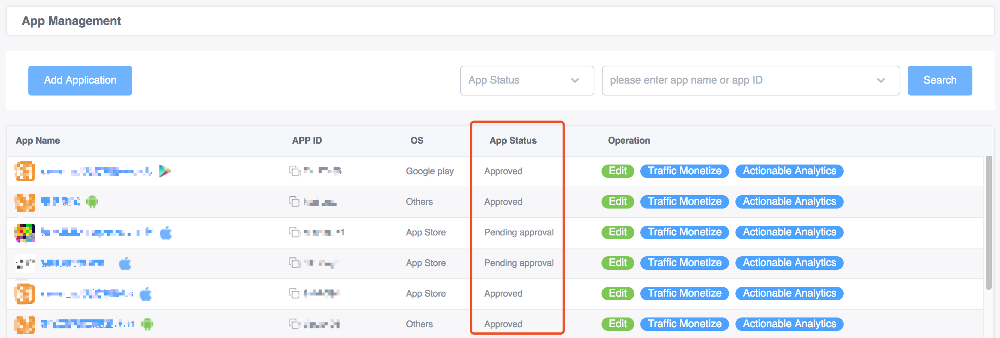
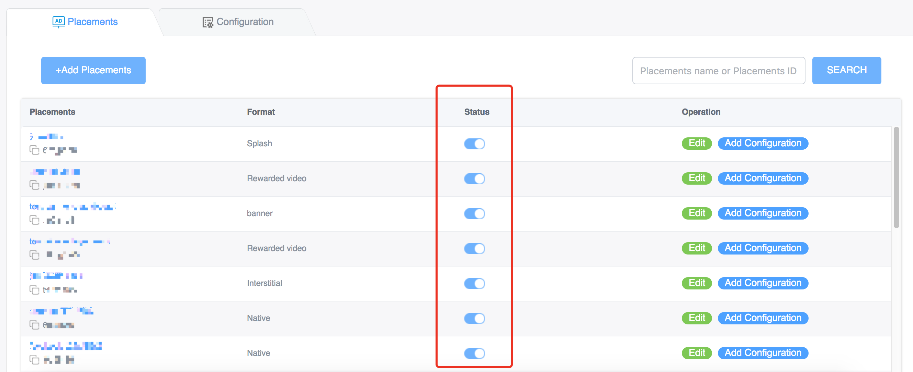
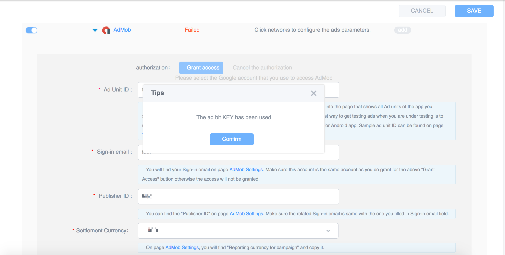

<!-- TOC -->

- [YumiMediationSDK Q&A](#yumimediationsdk-qa)
    - [System Operation](#system-operation)
        - [Can I  test my app when the app status is Pending Approval?](#can-i--test-my-app-when-the-app-status-is-pending-approval)
        - [How to pause monetization?](#how-to-pause-monetization)
        - [Why there's a popup saying "The ad bit KEY has been used" when I am adding or modifying a configuration?](#why-theres-a-popup-saying-the-ad-bit-key-has-been-used-when-i-am-adding-or-modifying-a-configuration)
    - [Statistics](#statistics)
        - [Can I see a real-time ad data and revenue data?](#can-i-see-a-real-time-ad-data-and-revenue-data)
        - [The data or revenue did not update on time. What should I do?](#the-data-or-revenue-did-not-update-on-time-what-should-i-do)
        - [Why does eCPM fluctuate?](#why-does-ecpm-fluctuate)
        - [What charging method do you use?](#what-charging-method-do-you-use)
    - [SDK Integration](#sdk-integration)
        - [How to integrate your SDK?](#how-to-integrate-your-sdk)
        - [Why can't I find the method in the integration guide?](#why-cant-i-find-the-method-in-the-integration-guide)
        - [Do I need to update the YumiMediationSDK when I update my app?](#do-i-need-to-update-the-yumimediationsdk-when-i-update-my-app)
        - [Why don't I see any ads / Why is the ad fill rate so low?](#why-dont-i-see-any-ads--why-is-the-ad-fill-rate-so-low)
        - [I do not have requirements for data in channels and app versions dimension. What should I fill in the ChannelID and VersionName?](#i-do-not-have-requirements-for-data-in-channels-and-app-versions-dimension-what-should-i-fill-in-the-channelid-and-versionname)
        - [Why some networks are disabled when I am testing?](#why-some-networks-are-disabled-when-i-am-testing)
        - [Why I can not see some of the networks when I am testing?](#why-i-can-not-see-some-of-the-networks-when-i-am-testing)
        - [I meet a crash after starting the app and the crash log has Admob-related descriptions. What should I do?](#i-meet-a-crash-after-starting-the-app-and-the-crash-log-has-admob-related-descriptions-what-should-i-do)
        - [Why can't I see ads after I call the ad display method?](#why-cant-i-see-ads-after-i-call-the-ad-display-method)
        - [What should I do if the ad material shows abnormally or the install button is invalid?](#what-should-i-do-if-the-ad-material-shows-abnormally-or-the-install-button-is-invalid)
        - [Why the game lagged after I integrate video ads?](#why-the-game-lagged-after-i-integrate-video-ads)
        - [How to hide the ad logo in the native ad?](#how-to-hide-the-ad-logo-in-the-native-ad)
        - [How to control the sound of the native ad?](#how-to-control-the-sound-of-the-native-ad)
        - [What should I do if the material does not fill the view fully?](#what-should-i-do-if-the-material-does-not-fill-the-view-fully)
        - [How to deal with the conflict between Firebase SDK and AdMob SDK when integrating iOS SDK?](#how-to-deal-with-the-conflict-between-firebase-sdk-and-admob-sdk-when-integrating-ios-sdk)
        - [Why the interstitial shows automatically in Android device without any action?](#why-the-interstitial-shows-automatically-in-android-device-without-any-action)
        - [How to deal with resource conflict issue in Android system?](#how-to-deal-with-resource-conflict-issue-in-android-system)
        - [How to adapt to Android 9.0?](#how-to-adapt-to-android-90)
        - [I'm integrating native ads of GDTMob by Android Studio. Why doesn't the video show?](#im-integrating-native-ads-of-gdtmob-by-android-studio-why-doesnt-the-video-show)
        - [What should I do if the number of methods exceeds 65535 when packaging Android app?](#what-should-i-do-if-the-number-of-methods-exceeds-65535-when-packaging-android-app)
        - [What should I do if there's an error message tells "Failed to find Build Tools…" when integrating Android Unity plugin?](#what-should-i-do-if-theres-an-error-message-tells-failed-to-find-build-tools-when-integrating-android-unity-plugin)
        - [What should I do if there's an error message tells "No toolchains found…" when integrating Android Unity plugin?](#what-should-i-do-if-theres-an-error-message-tells-no-toolchains-found-when-integrating-android-unity-plugin)
        - [What should I do if there's an error message tells "Failed to apply plugin…" when integrating Android Unity plugin?](#what-should-i-do-if-theres-an-error-message-tells-failed-to-apply-plugin-when-integrating-android-unity-plugin)
    - [Appendix](#appendix)
        - [Network Test ID](#network-test-id)
            - [iOS Test ID](#ios-test-id)
            - [Android Test ID](#android-test-id)

<!-- /TOC -->


# YumiMediationSDK Q&A
## System Operation
### Can I  test my app when the app status is Pending Approval? 
You can not test your app until it passes the review, but you can use test ID (Click to view [iOS test ID](https://github.com/yumimobi/YumiMediationSDKDemo-iOS/blob/master/normalDocuments/YumiMediationSDK%20for%20iOS(en).md#TEST-ID), [Android test ID](https://github.com/yumimobi/YumiMediationSDKDemo-Android/blob/master/docs/YumiMediationSDK%20for%20Android(en).md#52-test-ad-slot)) to test. The test ID will not generate incomes. 
  

### How to pause monetization? 
We provide status control of slots in our [Self-service System](https://ssp.yumimobi.com/?&oauth=dev_oauth#/app/appList/). To pause your slots' monetization, you need to switch off the status button in the Slots List. Please be noted that pausing the slot will affect your incomes immediately, so it is necessary to consider carefully before doing this.
  

### Why there's a popup saying "The ad bit KEY has been used" when I am adding or modifying a configuration? 
The ad bit KEY of a network can only be configured to one app. Please make sure which app you are going to configure, then close the configuration on the other app or change the ad bit KEY in the other app. If you can not find the app which is configured with the KEY, feel free to contact us at global@yumimobi.com.

  
  
## Statistics
### Can I see a real-time ad data and revenue data? 
The ad data will be displayed in real-time (with about 2-3 hours delay). The revenue data will be updated at 16:30 on the next day.  

### The data or revenue did not update on time. What should I do?
Occasionally, there will be a delay in updating data. It's very kind of you to wait with patience. If you have waited for a long time but still can not see the data, you can give us feedback at global@yumimobi.com.  

### Why does eCPM fluctuate?
The fluctuation of eCPM is determined by CTR and CPC. In most cases, CTR is basically stable; the fluctuation of CPC is mainly caused by the change in advertising competition. Advertiser's budget will affect the CPC of the market in different periods. If the traffic growth of the market is too fast during a certain period, it may affect eCPM because advertiser's bids are insufficient.

### What charging method do you use?
For now, we have CPC (cost per click) and CPM (cost per mille); the CPM is the main charging method. 

## SDK Integration
### How to integrate your SDK?
Please refer to our [Integration Guide](http://doc.ssp.yumimobi.com/IntegrateGuide/index).

### Why can't I find the method in the integration guide?
In most cases, it is because the SDK you used for integration is a very old one. To ensure your revenue, we recommend you to integrate our latest SDK. Click here to view [SDK Integration Guide](http://doc.ssp.yumimobi.com/IntegrateGuide/index).

### Do I need to update the YumiMediationSDK when I update my app? 
To ensure your revenue, we recommend you to update the YumiMediationSDK each time you update your app. You can check the new features of each version by viewing our changelog (Click to view [iOS Changelog](https://github.com/yumimobi/YumiMediationSDKDemo-Android/blob/master/SDK%20Changelog/iOS%20SDK%20Changelog.md), [Android Changelog](https://github.com/yumimobi/YumiMediationSDKDemo-Android/blob/master/SDK%20Changelog/Android%20SDK%20Changelog.md)).

### Why don't I see any ads / Why is the ad fill rate so low?
There may be several reasons for not seeing an ad. Please check in which OS you meet the issue and troubleshoot it with below information.
1. General reasons
  - The package name is not the same. Please make sure that the package name you fill in our [Self-service System](https://ssp.yumimobi.com/?&oauth=dev_oauth#/app/appList/) is the same with your app's package name. Otherwise, you may not see the ads. 
  - Your app has not been approved. Your app will not get any ad response before it is approved. When you are testing, we recommend you use our test ID (Click to view [iOS test ID](https://github.com/yumimobi/YumiMediationSDKDemo-iOS/blob/master/normalDocuments/YumiMediationSDK%20for%20iOS(en).md#TEST-ID), [Android test ID](https://github.com/yumimobi/YumiMediationSDKDemo-Android/blob/master/docs/YumiMediationSDK%20for%20Android(en).md#52-test-ad-slot)) to test. 
  - If your app is approved and you want to test with your real Yumi ID, we can provide you other networks' test ID which is found in their test app. You can configure these IDs in our [Self-service system](https://ssp.yumimobi.com/?&oauth=dev_oauth#/app/appList/). See more details in [Appendix - Network Test ID](#network-test-id)
2. iOS integration checklist
  - Please check your ATS setting. ATS (App Transport Security) proposed by WWDC 15 features an important method for Apple to boost network communication security. Non-HTTPS access will be banned by default for ios 9 and later. About how to set correct ATS setting, Please see in [iOS integration guide - App Transport Security](https://github.com/yumimobi/YumiMediationSDKDemo-iOS/blob/master/normalDocuments/YumiMediationSDK%20for%20iOS(en).md#app-transport-security). 

3. Android integration checklist
  - In Android 6.0 and higher versions (when the targetSdkVersion is 23 or higher), you need to add codes manually to request for user's permission. You can use the below method to check permissions and use a popup to request the user's permission.
    
    ```java
    YumiSettings.runInCheckPermission(true);
    ``` 
    
    The default parameter of this method is false. When it is false, the user will not receive a permission popup. If you set it to true, Yumi SDK will check and request for user's permission. You need to call this method before the ad initialization.

    Note: If you can not see the permission request popup after setting the value to true, please check if the support-v4.jar exists in your project.
    
  - Baidu network needs extra permission for getting ad response. If you can not see ads when you integrate Baidu network, please check if the app has below permissions: 

      ```xml
      <uses-permission android:name="android.permission.READ_PHONE_STATE" />
      <uses-permission android:name="android.permission.WRITE_EXTERNAL_STORAGE" />
      <uses-permission android:name="android.permission.ACCESS_COARSE_LOCATION" />
      ```

  - GDT network needs extra permission for getting ad response. If you can not see ads when you integrate GDTMob network, please check if the app has below permissions: 
      
      ```xml
      <uses-permission android:name="android.permission.READ_PHONE_STATE" />
      <uses-permission android:name="android.permission.ACCESS_COARSE_LOCATION" />
      <uses-permission android:name="android.permission.ACCESS_FINE_LOCATION" /> 
      <uses-permission android:name="android.permission.WRITE_EXTERNAL_STORAGE" />
      <uses-permission android:name="android.permission.REQUEST_INSTALL_PACKAGES" />
      ```

### I do not have requirements for data in channels and app versions dimension. What should I fill in the ChannelID and VersionName?
It's OK to fill in an empty value if you do not have any requirement. If you want to compare your app's performance in different app versions, you can fill in the number of your app version. Take banner as an example: if you are going to launch your Popstar (5.1.0 version) in Huawei market, you can fill in banner.setChannelID("huawei") and banner.setVersionName("5.1.0"). 

### Why some networks are disabled when I am testing? 
To enable one network, you need to configure it in our [Self-service System](https://ssp.yumimobi.com/?&oauth=dev_oauth#/app/appList/). 
  

### Why I can not see some of the networks when I am testing? 
Networks that haven't been integrated into your project will not be shown. If you want to test a network, please first make sure it has already been integrated into your project. 
  
  
### I meet a crash after starting the app and the crash log has Admob-related descriptions. What should I do?
- For iOS integration: Please view the info.plist file part in [AdMob Integration Guide (iOS)](https://developers.google.com/admob/ios/quick-start).
- For Android integration: Please view the AndroidManifest.xml file part in [AdMob Integration Guide (Android)](https://developers.google.com/admob/android/quick-start).

### Why can't I see ads after I call the ad display method?
After calling the ad display method, there are two possible reasons for not seeing the ad:
1. The ad has not been prepared. Please listen to the ad-is-prepared callback and call the ad display method after its preparation. 
2. The ad has been prepared, but you request the next ad immediately after the ad displays. In this occasion, the current ad will be destroyed and can not be displayed. To avoid this, please do not request another ad when there is an ad displaying. 

### What should I do if the ad material shows abnormally or the install button is invalid?
Please contact us at global@yumimobi.com and attach screenshots, keywords, material file, ad target URL in the email. 

Here is an example about material file: 
  
  
### Why the game lagged after I integrate video ads?
Frequently calling isReady() or isMediaPrepared() may result game lag. We recommend you call the method every 5 seconds. Without the frequency limit, the memory footprint will increase and the game will lag. 

### How to hide the ad logo in the native ad?
Yumi SDK provides option to hide the ad logo in native ad. For more information, see [iOS Integration Guide - YumiMediationNativeAdConfiguration](https://github.com/yumimobi/YumiMediationSDKDemo-iOS/blob/master/normalDocuments/YumiMediationSDK%20for%20iOS(en).md#yumimediationnativeadconfiguration) and [Android Integration Guide - Other Settings](https://github.com/yumimobi/YumiMediationSDKDemo-Android/blob/master/docs/YumiMediationSDK%20for%20Android(en).md#354-other-settings).

### How to control the sound of the native ad?
There's no method to control the sound of native ad because other networks do not provide an interface for controlling sound.

### What should I do if the material does not fill the view fully? 
You can make the material fully fill  the view through the below method:

iOS: 
```objective-c
imageView.contentMode = UIViewContentModeScaleToFill;
```
Android:
```java
imageView.setScaleType(ImageView.ScaleType.FIT_XY);
```
If the material streched after using this method, please contact us at global@yumimobi.com with slot id and request size. We will adjust the ad response for you. 

### How to deal with the conflict between Firebase SDK and AdMob SDK when integrating iOS SDK?
The conflict is caused by repeated codes of Firebase SDK and AdMob SDK. To solve this issue, please integrate AdMob SDK manually. The steps are as follows:
1. Delete AdMob network in `YumiMediationAdapters`
2. Add AdMob SDK of Firebase in Podfile

   ```ruby
   pod 'Firebase/AdMob'
   ```

   Run ```pod install``` in the command line to complete installation of AdMob SDK of Firebase
3. Input YumiMediationAdMob (the AdMob adapter of Yumi) manually
    (1) Download AdMob adapter of Yumi in the AdMob part in [SDKDownloadPage-iOS](https://github.com/yumimobi/YumiMediationSDKDemo-iOS/blob/master/normalDocuments/iOSDownloadPage.md).
    (2) Input Resources and YumiMediationAdMob.framework to Xcode project (do not input other files).

   

### Why the interstitial shows automatically in Android device without any action? 

The parameter of showInterstitial(false) controls the auto-display of interstitial. If the parameter is true, the interstitial will auto display once it finishes loading. If you do not intend to auto display interstitial, please set the parameter false. For more information, see [Display and Destroy](https://github.com/yumimobi/YumiMediationSDKDemo-Android/blob/master/docs/YumiMediationSDK%20for%20Android(en).md#322-display-and-destroy).

### How to deal with resource conflict issue in Android system?

1. Check the error log and identify which resource causes the conflict;
2. Check which library has loaded this resource in your project;
3. If the library you find in step 2 is not directly referenced by your project. You can use `./gradlew app:dependencies > dependencies.txt` to export project dependencies to the dependencies.txt file; then find the conflict resource in this file;
4. Delete the repeated resource.

### How to adapt to Android 9.0?
Some networks, such as Mintegral, currently do not support Android 9.0 and higher os versions. If the app crashes in Android 9.0 or higher os versions, you can solve the issue by setting the targaetSDKveriosn value 27 or lower.

### I'm integrating native ads of GDTMob by Android Studio. Why doesn't the video show? 
If you are integrating GDTMob by Android Studio, please make sure the package:"xxx.xxx.xxx" in AndroidManifest.xml of your app is the same as the applicationId "xxx.xxx.xxx" in build.gradle, as shown below:


### What should I do if the number of methods exceeds 65535 when packaging Android app?

To avoid this situation, you can use the method [Google provides](https://developer.android.com/studio/build/multidex). The steps are as follows: 
(1) Enable multidex and add the multidex library as a dependency, as shown here: 
```groovy
defaultConfig {   
        applicationId "XXX"
        minSdkVersion 16
        targetSdkVersion 28
        multiDexEnabled true
}

dependencies {
        compile 'com.android.support:multidex:1.0.3'
 }
```

(2) Add below method in Application class:
```java
@Override
protected void attachBaseContext(Context base) {
       super.attachBaseContext(base);
       MultiDex.install(this);
}
```

  
### What should I do if there's an error message tells "Failed to find Build Tools…" when integrating Android Unity plugin?
Error message: 
   ```
   * What went wrong:
   A problem occurred configuring root project 'gradleOut'.
   > Failed to find Build Tools revision 29.0.0
   ```
Solution:
Delete `buildToolsVersion '**BUILDTOOLS**'` from [mainTemplet](https://github.com/yumimobi/YumiMediationSDK-Unity/blob/master/Assets/Plugins/Android/mainTemplate.gradle)

### What should I do if there's an error message tells "No toolchains found…" when integrating Android Unity plugin?
Error message:
   ```
   * What went wrong:
   A problem occurred configuring root project 'gradleOut'.
   > No toolchains found in the NDK toolchains folder for ABI with prefix: mips64el-linux-android
   ```
Solution:
Modify gradle plugin version in [mainTemplet](https://github.com/yumimobi/YumiMediationSDK-Unity/blob/master/Assets/Plugins/Android/mainTemplate.gradle). For example: Change `classpath 'com.android.tools.build:gradle:3.0.1'` to `classpath 'com.android.tools.build:gradle:3.2.1'`。

### What should I do if there's an error message tells "Failed to apply plugin…" when integrating Android Unity plugin?
Error message:
   ```
   * What went wrong:
   A problem occurred evaluating root project 'gradleOut'.
   > Failed to apply plugin [id 'com.android.application']
      > Minimum supported Gradle version is 4.6. Current version is 4.2.1. If using the gradle wrapper, try editing the distributionUrl in
   ```
Solution (any of below method will work):
- Upgrade gradle version. Update the gradle version to the version which error message mentions. Take the above message as an example, you need to upgrade gradle version to 4.6.
- Reduce the gradle plugin version. Please do as follows:
    (1) Identify the current gradle version according to the error message. Take the above message as an example, the current gradle version is 4.2.1;
    (2) Identify the corresponding gradle plugin version of your current gradle version through [Update Gradle](https://developer.android.com/studio/releases/gradle-plugin#updating-gradle). Take the above message as an example, the corresponding gradle plugin version is 3.0.0+;
    (3) Reduce the gradle plugin version to the version you identified in step (2). Take the above message as an example, the `classpath 'com.android.tools.build:gradle:x.x.x'` in the [mainTemplet](https://github.com/yumimobi/YumiMediationSDK-Unity/blob/master/Assets/Plugins/Android/mainTemplate.gradle) should be changed to `classpath 'com.android.tools.build:gradle:3.0.0+'`. 

## Appendix
### Network Test ID
If there's no ad fill with your real networks' ID, we provide below test IDs which are found in the networks' test app. If you still can not see ad with below ID, please contact with the Network for help. Be noted that one test ID can only be used to one app. Make sure which app you are going to test and avoid configuring the same test ID in other apps. 

#### iOS Test ID
1. Banner

|Network|Key 1|Key 2|
|-|-|-|
|AdMob|For details, see in [AdMob Test Ad](https://developers.google.com/admob/ios/test-ads)|||
|Baidu|App ID：ccb60059|adId: 3722589||
|BytedanceAds|应用 ID：5000546|代码位 ID：900546859||
|Facebook|Placement ID: YOUR_PLACEMENT_ID|||
|GDTMob|APP ID: 1105344611|placement ID: 1080958885885321||
|IQzone|Placement ID: eEZBeUY3ajRRUWM1MW5rZWpEYjB5WHZOZUR1UXJua0doa1dPS2Fha0Rsd2hCRElz|||
|Inneractive|App ID: 102960|Spot ID: 150942|| 


2. Interstitial

|Network|Key 1|Key 2|Key 3|
|-|-|-|-|
|AdMob|For details, see in [AdMob Test Ad](https://developers.google.com/admob/ios/test-ads)|||
|BytedanceAds|应用 ID：5000546|代码位 ID：900546941||
|Chartboost|APP ID: 5b9b2c8d61c3570e1974a657|App Signature: 43b4fcee44c0ca91b13ca2724fb0df124377248f||
|Facebook|Placement ID: YOUR_PLACEMENT_ID|||
|GDTMob|APP ID: 1105344611|placement ID: 1050652855580392||
|IronSource|App Key: 8545d445|Instance Id: 0||
|InMobi|APP ID: 4028cb8b2c3a0b45012c406824e800ba|Placement ID: 1446377525790||
|IQzone|Placement ID: ZjlVZnFtcVFhQ1ZpWFpzS295MVBSQjlZWmNJUVQyekpEZllxbUhtU21yTFZwSzFz|||
|Mintegral|APP ID: 92763|APP Key: 936dcbdd57fe235fd7cf61c2e93da3c4|Unit ID: 21321|
|UnityAds|Game ID: 14850|Placement ID: video||
|Vungle|APP ID: 58a278a658c8501e56000127|Rewarded Placement Reference ID: IOSTEST26212|Interstitial Placement Reference ID: IOSTEST35317|
|ZPLAYAds|APP ID: A650AB0D-7BFC-2A81-3066-D3170947C3DA|AdUnit ID: 0868EBC0-7768-40CA-4226-F9924221C8EB||
|Inneractive|App ID: 102960|Spot ID: 150946||

3. Rewarded Video

|Network|Key 1|Key 2|Key 3|
|-|-|-|-|
|AdColony|App ID: appbdee68ae27024084bb334a|Zone ID: vzf8e4e97704c4445c87504e||
|AdMob|For details, see in [AdMob Test Ad](https://developers.google.com/admob/ios/test-ads)|||
|Baidu|App ID：ccb60059|adId: 5889473||
|BytedanceAds|应用 ID：5000546|代码位 ID：900546826||
|Facebook|Placement ID: YOUR_PLACEMENT_ID|||
|GDTMob|APP ID: 1105344611|placement ID: 8020744212936426||
|IronSource|App Key: 8545d445|Instance Id: 0||
|IQzone|Placement ID: cnlWVXNOUXliczRPSlBOWjQ5dllMVTd1dlVMTEZtK1ZKWkZ1dTJVVkFvdHlpenh6|||
|Tapjoy|SDK Key: E7CuaoUWRAWdz_5OUmSGsgEBXHdOwPa8de7p4aseeYP01mecluf-GfNgtXlF| Placement: video_unit|
|Mintegral|APP ID: 92763|APP Key: 936dcbdd57fe235fd7cf61c2e93da3c4|Unit ID: 21319|
|UnityAds|Game ID: 14850|Placement ID: rewardedVideo||
|Vungle|APP ID: 58a278a658c8501e56000127|Rewarded Placement Reference ID: IOSTEST26212|Interstitial Placement Reference ID: IOSTEST35317|
|ZPLAYAds|APP ID: A650AB0D-7BFC-2A81-3066-D3170947C3DA|AdUnit ID: BAE5DAAC-04A2-2591-D5B0-38FA846E45E7||
|Inneractive|App ID: 110038|Spot ID: 199508||

4. Native

|Network|Key 1|Key 2|
|-|-|-|
|AdMob|For details, see in [AdMob Test Ad](https://developers.google.com/admob/ios/test-ads)|
|Baidu|App ID：ccb60059|adId: 2058621|
|BytedanceAds|应用 ID：5000546|代码位 ID：900546910|
|Facebook|Placement ID: YOUR_PLACEMENT_ID|
|GDTMob|APP ID: 1105344611|placement ID: 3050349752532954|

5. Splash

|Network|Key 1|Key 2|
|-|-|-|
|AdMob|For details, see in [AdMob Test Ad](https://developers.google.com/admob/ios/test-ads)|
|Baidu|App ID：ccb60059|adId: 2058492|
|BytedanceAds|应用 ID：5000546|代码位 ID：800546808|
|GDTMob|APP ID: 1105344611|placement ID: 9040714184494018|

#### Android Test ID
1. Banner

|Network|Key 1|Key 2|Key 3|
|-|-|-|-|
|AdMob|For details, see in [AdMob Test Ad](https://developers.google.com/admob/android/test-ads)|||
|Baidu|App ID：e866cfb0|adId: 2015351||
|BytedanceAds|应用ID：5001121|代码位ID：901121987|
|Facebook|Placement ID: YOUR_PLACEMENT_ID|
|GDTMob|APP ID: 1101152570|placement ID: 4080052898050840||
|IQzone|Placement ID: UkJ1RVVoQmxOQkdub0RaWFFoVjVYNTRHRHVEQlJycWVacEZBQnppbitZdzEwcThY|||


2. Interstitial

|Network|Key 1|Key 2|Key 3|
|-|-|-|-|
|AdMob|For details, see in [AdMob Test Ad](https://developers.google.com/admob/android/test-ads)|||
|Baidu|App ID：e866cfb0|adId: 2403633||
|BytedanceAds|应用ID：5001121|代码位ID：901121725|
|Facebook|Placement ID: YOUR_PLACEMENT_ID|
|GDTMob|APP ID: 1101152570|placement ID: 3040652898151811||
|IronSource|App Key: 85460dcd|Instance Id: 0||
|IQzone|Placement ID: Qjd3TytYVllmRmhTYkp3Ri8yanVHTWNuUDBSSElmdXVoTkcyVTR0WkhRc054M0gv|||
|Mintegral|APP ID:92762 |APP Key:936dcbdd57fe235fd7cf61c2e93da3c4 	 |Unit ID:21312 |
|UnityAds|Game ID: 1306584|Placement ID: video||
|ZPLAYAds|APP ID: 5C5419C7-A2DE-88BC-A311-C3E7A646F6AF|AdUnit ID: 19393189-C4EB-3886-60B9-13B39407064E||

3. Rewarded Video

|Network|Key 1|Key 2|Key 3|
|-|-|-|-|
|AdColony|App ID: app185a7e71e1714831a49ec7|Zone ID: vz1fd5a8b2bf6841a0a4b826|
|AdMob|For details, see in [AdMob Test Ad](https://developers.google.com/admob/android/test-ads)|||
|Baidu|App ID：e866cfb0|adId: 5925490||
|BytedanceAds|应用ID：5001121|代码位ID：901121365|
|Facebook|Placement ID: YOUR_PLACEMENT_ID|
|GDTMob|APP ID: 1101152570|placement ID: 2090845242931421||
|IronSource|App Key: 85460dcd|Instance Id: 0||
|Inneractive|App ID: 110039|Spot ID: 199510|
|IQzone|Placement ID: MFllRXhOZ1Nnbi9ycVQ2emRCVW1hdlI2SlZ2bzB4WVc4SWZFUUJCb0EzTW8xRXlw|||
|Mintegral|APP ID: 92762|APP Key：936dcbdd57fe235fd7cf61c2e93da3c4|Unit ID: 21310|
|UnityAds|Game ID: 1306584|Placement ID: rewardedVideo||
|ZPLAYAds|APP ID: 5C5419C7-A2DE-88BC-A311-C3E7A646F6AF|AdUnit ID: 3FBEFA05-3A8B-2122-24C7-A87D0BC9FEEC||

4. Native

|Network|Key 1|Key 2|
|-|-|-|
|AdMob|For details, see in [AdMob Test Ad](https://developers.google.com/admob/android/test-ads)|
|Baidu|App ID：e866cfb0|adId: 2362913|
|BytedanceAds|应用ID：5001121|代码位ID：901121737|
|Facebook|Placement ID: YOUR_PLACEMENT_ID|
|GDTMob|APP ID: 1101152570|placement ID: 2000629911207832|

5. Splash

|Network|Key 1|Key 2|
|-|-|-|
|AdMob|For details, see in [AdMob Test Ad](https://developers.google.com/admob/android/test-ads)|
|Baidu|App ID：e866cfb0|adId: 2058622|
|BytedanceAds|应用ID：5001121|代码位ID：801121648|
|GDTMob|APP ID: 1101152570|placement ID: 8863364436303842593|
