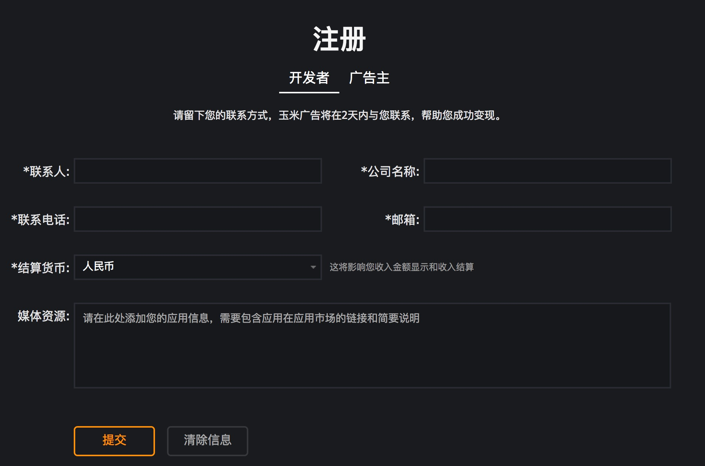

## 一、账号创建：
##### 1. 如何注册玉米移动账号？
-  登录[玉米移动官网](https://www.yumimobi.com/)，点击“申请开通”按钮。
-  选择开发者类别，填写注册信息。注意：登录密码及登录验证邮件会发送到注册时填写的邮箱，所以邮箱必须为可用邮箱。邮箱注册后会作为登录账号，不可更改。
    

##### 2.  如何进行账号激活？
- 从注册的邮箱中可以获取到账号的登录密码，使用注册的邮箱和收到的登录密码，登录[玉米移动官网](https://www.yumimobi.com/)，点击“登录”按钮登录系统。
- 首次登录需要完善账号联系信息、结算货币等信息，因为涉及到提现结算，请务必保证填写准确无误。

##### 3.  应用创建时，如果应用未上线，应该如何填写应用商店链接？
-   可以在下载链接一栏也填写该应用包名，但在上线前务必要联系玉米商务同学（可以发送邮件 support@yumimobi.com），修改为应用正式的应用商店链接，否则可能影响广告效果。

##### 4.  如果应用的应用商店地址与申请应用不匹配是否会展示广告？
-  会有广告展示，但可能影响广告效果，或导致数据异常被封禁。

##### 5.  如何区分各渠道、版本、或是广告位效果？
- 可以创建不同的广告位ID以区分效果。比如：要严格区分小米、百度及广点通等各个渠道

##### 6.  如果使用玉米聚合SDK，三方平台key在哪里配置？
- 玉米移动是托管变现，我们系统自动实现智能优化策略，开发者只需进行SDK部署与数据监测即可。轻松两步，便捷高效。

##### 7. 应用申请后，如果处于审核周期，在待审核状态时可否测试广告？
- 我们的应用审核周期为1个工作日；在审核周期内，不会影响广告测试及数据展示，但不会产生广告收入，因此您可以进行广告测试。

##### 8. 玉米聚合SDK支持哪些广告形式？
- 玉米聚合SDK支持现在所有主流的广告形式，包括横幅、插屏、激励视频、开屏、原生等广告形式。

##### 9. 在应用更新，是否要使用最新版本的玉米聚合SDK？
- 为了保证广告收益，应用更新时，请使用最新版本玉米聚合SDK。

##### 10. 应用更新需要暂时关闭广告，应该如何操作？
- 玉米前台提供广告暂停功能，点击暂停可以暂时关闭广告，点击恢复可以重新开启广告；

##### 11. 广告素材：要求屏蔽某些特定类型素材？
- 联系商务同学，提供素材关键字、行业；

## 数据问题

##### 1. 玉米广告数据及收入更新时间？
- 数据实时展示（有2~3小时延迟），广告收入次日16:30展示；

##### 2. 数据或收入没有按时更新？
- 可能是由于数据延迟的原因，请耐心等待；如较长时间仍未看到数据，请及时反馈。

##### 3. 为什么eCPM会有波动？
- eCPM的波动由ctr和cpc决定，大多数情况下，ctr基本保持稳定；cpc的波动主要是由于广告竞争情况的变化引起，在不同时间段广告主投放预算会对大盘的cpc有所影响。如果某个时期大盘流量增长过快，可能会因为广告主竞价不充分而影响到eCPM。

##### 4. 广告计费方式？
- CPC(点击计费)和CPM(千次广告展示计费)两种方式，以前者为主。

## SDK获取：
##### 1. 如何获取SDK？
-  Yumimobi SDK获取，登录账号，“文档中心”-2.2玉米聚合SDK下载即可获取玉米聚合SDK，之后按文档说明接入；

##### 2. 如何查看各版本SDK更新？
- 玉米后台提供的都是最新版本SDK，可以在“文档中心”-“更新日志”中，查看SDK更新的版本及更新日志；

## 代码相关
### Android类

##### 1. 如果广告素材存在变形、跳转等问题，如何处理？
- 提供素材截图、关键字、物料地址、素材跳转链接。

##### 2. 为什么只更新了核心jar包后会崩溃？
- 更新版本时核心 jar包与Adapter需要同时更新。新版本的三方平台可能有更新或者核心jar包调用Adapter会有变动，如果使用老的Adapter可能会导致崩溃或请求该平台广告失败。

##### 3. 添加视频广告导致游戏卡顿现象？
- 请检查调用isMediaPrepared()方法是否过于频繁，一般建议每5秒钟调用一次，如果调用不加频次控制可能会导致内存占用增加。

##### 4. 调用广告show方法后游戏黑屏？
- 在视频或者插屏未准备完成时调用show方法，并且只在展示回调中做了下一部逻辑的处理，将会导致游戏或应用卡住。

##### 5. 如何判断接入异常还是无填充？
- 可以打开调试模式窗口查看三方平台是否已正常接入。
- 也可根据抓包工具查看是否有请求，并且请求是否又返回来初步判断是否异常。如无任何请求，请根据文档中调试模式相关描述做出对应处理
- 如过有请求但是还是无广告展示，请检查返回结果是否为常见网络错误如404或500之类的。正常情况下Response Code 一般返回为200。网络请求异常一般为非客户端错误。

##### 6. 打包时方法数超标怎么办？（方法数超出65535）
- 可以询问我们的商务人员三方平台的添加优先级，按优先级删除三方平台Adapter。
- 可以通过google官方推荐的multidex包进行多dex编译的方法避免。

a. 导入multidex包，设置为支持多dex输出模式  

```
defaultConfig {   
        applicationId "XXX"
        minSdkVersion 14
        targetSdkVersion 23
        multiDexEnabled true
}

dependencies {
    compile 'com.android.support:multidex:1.0.1'
 }
```


b. Application 类重写方法：

```
@Override
protected void attachBaseContext(Context base) {
    super.attachBaseContext(base);
    MultiDex.install(this);
}
```


##### 7.protobuf包冲突怎么办？
- 如果您的项目中用到了protobuf并且和玉米聚合SDK中包含的protobuf冲突，请尽量使用玉米聚合SDK中的protobuf，如果玉米聚合SDK中的不能满足您的需求可以自行删除核心jar包中的protobuf（用rar打开并删除）。但是请务必通知玉米运营人员您删除了核心包中的protobuf，以便我们通过后台关闭需要使用protobuf的相关模块。

##### 8. 文档中所说的方法为什么没有找到。
- 接入使用的SDK 和参照的接入文档不是同一个版本

##### 9. Android 6.0及以上系统下为什么没有广告。
-    在Android 6.0系统开始权限系统有了变动，关于用户隐私的权限必须动态获取也就是弹权限提示框，玉米聚合SDK提供了动态获取权限的方法：YumiSettings.runInCheckPermission(true); 由于部分开发者是自己实现的，所以该方法默认是false。请参考文档中“Android6.0以上系统权限处理“。

##### 10. 为什么调用了show方法不出广告？
-  在show方法中又调用了 request方法
- 插屏或视频还没有准备完成就调用了show方法。请参考文档正常调用。

##### 11. 插屏为什么会自己突然就展示出来了？
-  showInterstitial(false) 方法中的参数代表了是否自动展示，如果填true在插屏广告准备完成后就会自动展示。请参考文档 ”展现插屏广告”相关内容。

##### 12. Android studio 接入使用远程依赖，远程依赖包下载失败，编译器提示：Could not find any matches for com.yumimobi.ads:mediation:3.*.*.+ as no versions of com.yumimobi.ads:mediation are available.
- 确认 android studio 的 Project 根目录主 build.gradle 中配置了 jcenter 支持。
```
buildscript {
    repositories {
        jcenter()
    }
}
allprojets {
    repositories {
        jcenter()
    }
}

```
- 也可以在项目的build.gradle中添加：
　
```
repositories {
    jcenter {
        url "http://jcenter.bintray.com/"
    }
}

```

##### 13. untiy视频无回调？
-  320（不包含）之前版本插屏和视频不可同时配置，联系相关人员确认配置

##### 14. vungle无任何回调内容？
- 插屏和视频不可同时配置，联系相关人员确认配置

##### 15. 调试模式下无任何平台，提示：Searching for third party ADnetwork adapters?
- 后台未配置广告，联系相关人员进行广告配置

##### 16. 三方平台有什么用？
-    增加三方平台可以提升广告填充率，添加方式为：将jar包（yumi_adapter_**_v3.*.*.jar）添加到您的项目中，同时参照《YumiMobi聚合广告SDK-三方支持列表》文档添加相应的依赖就可以了。如果使用的是 Android studio 只需要在builde.gradle中添加依赖项：
compile 'com.yumimobi.ads.mediation:*****:3.*.*.+' 。

##### 17. SDK接入没有问题，为什么换了正式ID后无法请求到广告？
- 新的广告位ID有可能还没有配置广告，联系玉米相关人员确认

##### 18. 调式插屏和激励视频的时候点击FETCH按钮出现interstitial onPrepareFailed LayerErrorCode:ERROR_NO_FAIL  MSG_CODE为5的错误是什么？
- 广告无填充，确认网络状态并多次尝试


### iOS类
##### 1. untiy/vungle无任何回调内容？
- 插屏和视频不可同时配置，联系相关人员确认配置

##### 2. 为什么调试模式下，页面提示'warning  NOT ad config或者显示平台为灰色？
- 确认调用调试模式下SDK已完成初始化，并在正常模式下进行过广告请求
-未进行广告配置，联系玉米相关人员确认

##### 3. demo无法编译？
-确认dome版本和SDK接入版本是否一致，根据官网地址提供的Githubdizhi 在“Branch_*.*.*”分支下查看对应版本

##### 4. 320以后版本可以通过修改dome中的‘podfile’来更新dome

##### 5. 验证 podspec 文件需注意： s.vendored_libraries = libxxx.a (前缀必须为lib)

##### 4. 视频SDK调用debugcenter之后会导致单例对象delegate被释放

##### 5. 303，304版本不支持 Xcode9 之前版本

##### 6. Admob 某些情况需要GLKit.framework


